<div align="center">

# Kilang Desa Murni Batik

**Platform E-Dagang Lengkap untuk Batik Malaysia**

*Full-stack e-commerce platform powering a traditional Malaysian batik factory's digital operations*

[]()
[]()
[]()
[]()
[]()
[]()

**Direka, dibina, dan diurus sepenuhnya oleh seorang pembangun**

</div>

---

## Pembangun

| | |
|---|---|
| **Nama** | **Muhammad Luqman** |
| **Peranan** | Solo Full-Stack Developer & System Architect |
| **Skop** | Reka bentuk seni bina, pembangunan backend & frontend, reka bentuk pangkalan data, integrasi API luaran, DevOps & deployment, pengurusan infrastruktur |
| **Lokasi** | Terengganu, Malaysia |

> Keseluruhan platform ini — dari reka bentuk seni bina microservices, pembangunan 10 backend services dalam Go, 4 frontend apps dalam Next.js/TypeScript, reka bentuk 9 skema pangkalan data dengan 254 model, integrasi Shopee & TikTok API, sehingga deployment 21 Docker containers dalam production — dibina sepenuhnya secara solo oleh seorang pembangun.

---

## Tentang Projek

Kilang Desa Murni Batik ialah platform digital hujung-ke-hujung (*end-to-end*) yang menghubungkan kilang batik tradisional dengan pembeli moden. Sistem ini mengurus keseluruhan operasi perniagaan — dari pengurusan katalog produk, pemprosesan pesanan, penjejakan inventori, hingga integrasi marketplace seperti Shopee dan TikTok Shop.

Dibina dari awal menggunakan seni bina **perkhidmatan mikro (microservices)** dengan 10 backend services, 4 frontend apps, dan 21 Docker containers dalam production.

---

## Seni Bina Sistem


---

## Ciri-Ciri Utama

### Kedai Online (Storefront)
| Ciri | Penerangan |
|------|------------|
| Katalog Produk | Paparan produk dengan carian pantas Meilisearch, penapis kategori & koleksi |
| Troli Beli-belah | Tambah ke troli, kemaskini kuantiti, checkout serta-merta |
| Pembayaran | Integrasi gateway pembayaran dengan penjejakan status |
| Akaun Pelanggan | Pendaftaran, log masuk, sejarah pesanan, alamat tersimpan |
| Responsif | Dioptimumkan untuk telefon bimbit dan desktop |

### Panel Admin (Dashboard)
| Ciri | Penerangan |
|------|------------|
| Pengurusan Pesanan | Lihat, proses, dan jejak semua pesanan dari semua saluran |
| Pengurusan Produk | CRUD produk, varian, imej, dan harga |
| Inventori | Penjejakan stok masa nyata, amaran stok rendah, pemindahan gudang |
| Pelanggan & CRM | Senarai pelanggan, sejarah pembelian, segmentasi |
| Laporan & Analitik | Jualan harian/bulanan, produk terlaris, prestasi ejen |
| Integrasi Shopee | Sambung kedai Shopee, segerak produk & pesanan automatik |
| Pengurusan Ejen | Daftar ejen, tetapkan komisyen, jejak prestasi |
| Sokongan Pelanggan | Sistem tiket untuk pertanyaan dan aduan |

### Integrasi Marketplace
| Ciri | Penerangan |
|------|------------|
| Shopee Open Platform | OAuth, segerak produk, segerak pesanan automatik setiap 15 minit |
| TikTok Shop | Integrasi API untuk pengurusan produk dan pesanan |
| Penyegerakan Stok | Kemas kini stok merentasi semua saluran jualan secara automatik |
| Pengurusan Token | Auto-refresh token OAuth sebelum tamat tempoh |

### Sistem Ejen
| Ciri | Penerangan |
|------|------------|
| Portal Ejen | Dashboard khusus untuk ejen membuat pesanan |
| Komisyen Automatik | Pengiraan dan penjejakan komisyen berdasarkan jualan |
| Katalog Ejen | Akses produk dengan harga ejen khas |

---

## Tech Stack

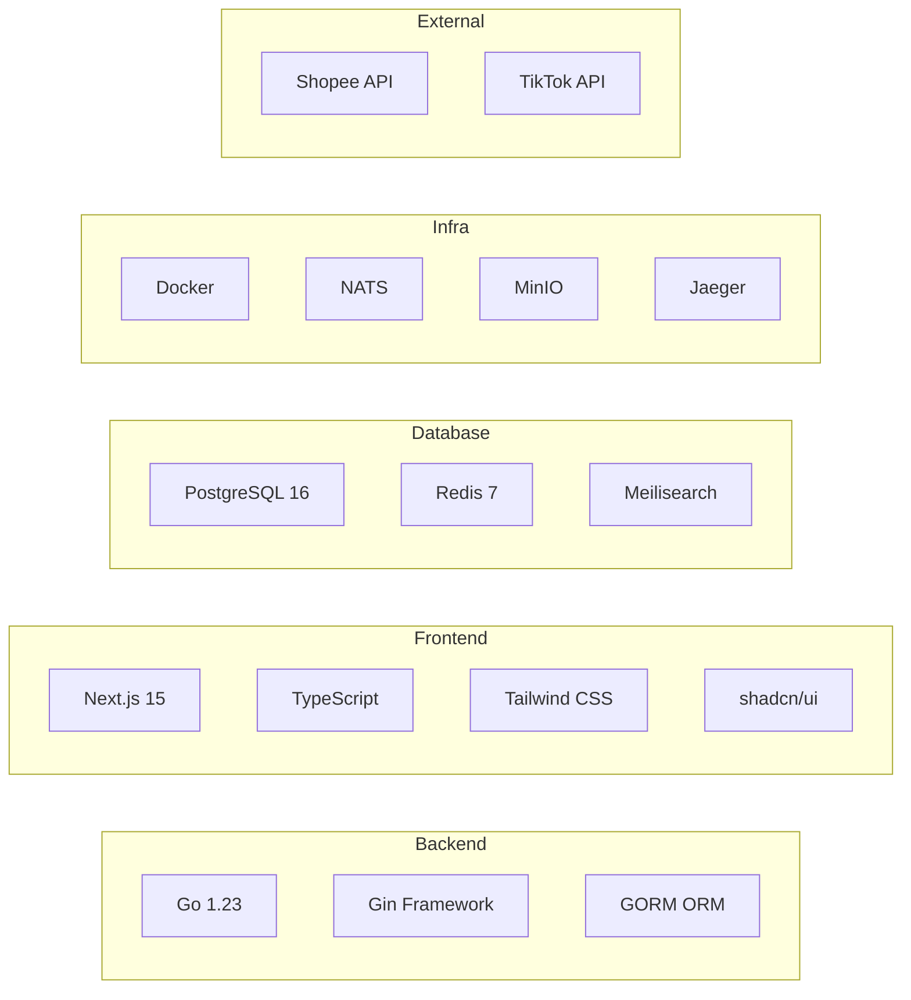

| Lapisan | Teknologi | Tujuan |
|---------|-----------|--------|
| **Bahasa Backend** | Go 1.23 | Perkhidmatan mikro berprestasi tinggi |
| **Framework Web** | Gin | HTTP router & middleware |
| **ORM** | GORM | Interaksi pangkalan data |
| **Bahasa Frontend** | TypeScript | Keselamatan jenis (*type safety*) |
| **Framework UI** | Next.js 15 (App Router) | SSR, routing, API proxy |
| **Komponen UI** | shadcn/ui + Tailwind CSS | Antara muka pengguna moden |
| **Pangkalan Data** | PostgreSQL 16 | Data utama dengan skema khusus |
| **Cache** | Redis 7 | Cache sesi, analitik, token |
| **Carian** | Meilisearch | Carian produk pantas (*full-text*) |
| **Message Broker** | NATS | Komunikasi antara servis (event-driven) |
| **Storan Objek** | MinIO | Imej produk, dokumen |
| **Tracing** | Jaeger + OpenTelemetry | Penjejakan permintaan teragih |
| **Reverse Proxy** | Nginx | SSL termination, load balancing |
| **Kontena** | Docker Compose | Orkestrasi 21 kontena |

---

## Statistik Kod

```
  Jumlah Kod Sumber
  ═══════════════════════════════════════
  Backend (Go)         : 115,160 baris  │  493 fail
  Frontend (TypeScript): 135,836 baris  │  589 fail
  ─────────────────────────────────────
  JUMLAH               : 250,996 baris  │ 1,082 fail
```

### Backend — 10 Perkhidmatan Mikro

| Perkhidmatan | Baris Kod | Penerangan |
|-------------|-----------|------------|
| `service-catalog` | 28,526 | Pengurusan produk, kategori, koleksi, carian |
| `service-order` | 26,681 | Pesanan, pembayaran, penghantaran, aliran kerja |
| `service-marketplace` | 14,421 | Integrasi Shopee & TikTok, auto-sync |
| `service-inventory` | 10,924 | Stok, gudang, pemindahan, amaran |
| `service-auth` | 8,428 | Pengesahan JWT, sesi, peranan |
| `service-customer` | 7,625 | Profil pelanggan, alamat, CRM |
| `service-agent` | 7,044 | Ejen jualan, komisyen, pesanan ejen |
| `service-reporting` | 4,669 | Laporan jualan, analitik, eksport |
| `service-support` | 4,566 | Tiket sokongan, pertanyaan pelanggan |
| `service-notification` | 2,276 | Notifikasi email & mesej |

### Frontend — 4 Aplikasi

| Aplikasi | Baris Kod | Penerangan |
|----------|-----------|------------|
| `frontend-admin` | 74,007 | Panel pentadbir penuh |
| `frontend-storefront` | 54,325 | Kedai online pelanggan |
| `frontend-agent` | 3,981 | Portal ejen jualan |
| `frontend-warehouse` | 3,523 | Pengurusan gudang |

### Infrastruktur

| Komponen | Bilangan |
|----------|----------|
| API Endpoints | 800+ |
| Model Pangkalan Data | 254 |
| Docker Containers | 21 |
| Git Repositories | 22 |
| Skema PostgreSQL | `auth`, `catalog`, `inventory`, `sales`, `customer`, `agent`, `marketplace`, `support`, `reporting` |

---

## Reka Bentuk Pangkalan Data (Database Design)

Satu pangkalan data PostgreSQL dengan 9 skema berasingan — setiap perkhidmatan mikro memiliki skema sendiri untuk pengasingan data (*schema-per-service pattern*).

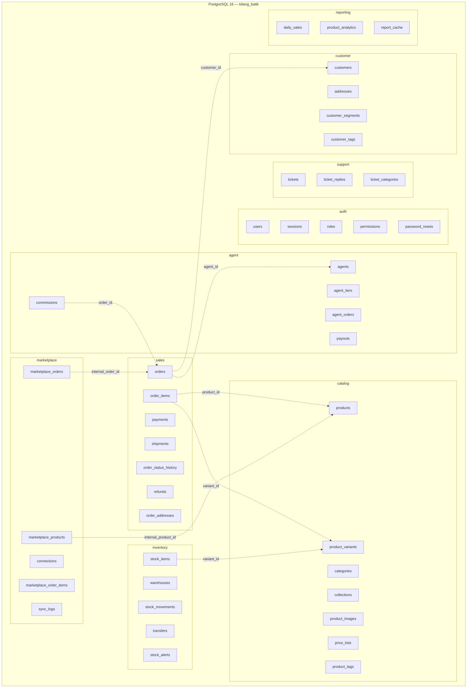

### Ciri-Ciri Pangkalan Data

| Ciri | Penerangan |
|------|------------|
| Schema-per-Service | Setiap servis memiliki skema sendiri — pengasingan data yang jelas |
| Foreign Key Constraints | Rujukan silang antara skema untuk integriti data |
| Check Constraints | Pengesahan di peringkat DB (contoh: jumlah pesanan mesti positif) |
| Indeks Optimum | B-tree, GIN, dan partial indexes untuk prestasi query |
| UUID Primary Keys | Setiap rekod menggunakan UUID v4 — selamat untuk sistem teragih |
| Soft Deletes | Rekod tidak dipadam, hanya ditanda `deleted_at` |
| Audit Columns | `created_at`, `updated_at`, `created_by` pada setiap jadual |
| GORM AutoMigrate | Migrasi automatik semasa startup servis |

---

## Keselamatan (Security)

| Lapisan | Amalan |
|---------|--------|
| **Pengesahan** | JWT (access + refresh token) dengan sesi Redis |
| **Kata Laluan** | bcrypt hashing dengan cost factor 12 |
| **Kebenaran** | Role-Based Access Control (RBAC) — 5 peranan berlapis |
| **API Protection** | Auth middleware pada semua endpoint dilindungi |
| **Token OAuth** | Disulitkan (AES-256) sebelum disimpan dalam DB |
| **CORS** | Konfigurasi ketat — hanya domain dibenarkan |
| **Input Validation** | Pengesahan input pada setiap handler (Gin binding) |
| **SQL Injection** | Dicegah oleh GORM parameterized queries |
| **Rate Limiting** | Had kadar pada endpoint sensitif |
| **HTTPS** | SSL/TLS termination di Nginx (Let's Encrypt) |
| **Env Secrets** | Rahsia disimpan sebagai env vars, bukan dalam kod |

---

## Cabaran Teknikal & Penyelesaian

Beberapa cabaran teknikal utama yang diselesaikan semasa pembangunan platform ini:

### 1. Penyegerakan Pesanan Marketplace dengan Diskaun Shopee
**Masalah:** Shopee membenarkan baucar/diskaun yang menjadikan jumlah pesanan lebih rendah daripada jumlah item. Ini menyebabkan `shipping_cost` menjadi negatif dan melanggar *check constraint* dalam PostgreSQL.

**Penyelesaian:** Logik pintar dalam `CreateMarketplaceOrder` — apabila `TotalAmount < subtotal`, sistem mengira perbezaan sebagai `discount` dan menetapkan `shipping_cost = 0`, mengelakkan nilai negatif.

### 2. Seni Bina Event-Driven dengan NATS JetStream
**Masalah:** Servis perlu berkomunikasi secara asinkron tanpa saling bergantung (*loose coupling*). Contoh: apabila pesanan dicipta, inventori perlu dikemas kini dan notifikasi perlu dihantar — tanpa Order Service perlu tahu tentang kedua-dua servis tersebut.

**Penyelesaian:** Implement NATS JetStream sebagai event bus. Setiap servis menerbitkan (*publish*) event, dan servis lain melanggan (*subscribe*) secara bebas. 22+ jenis event merentasi sistem.

### 3. Pengurusan Token OAuth Shopee yang Tamat Tempoh
**Masalah:** Token OAuth Shopee tamat setiap 4 jam. Jika token tamat semasa auto-sync, semua operasi akan gagal.

**Penyelesaian:** Background token manager yang memeriksa token setiap 5 minit dan membaharui secara automatik 30 minit sebelum tamat tempoh — memastikan token sentiasa aktif.

### 4. Padanan SKU Merentasi Platform
**Masalah:** Produk di Shopee mempunyai SKU yang berbeza daripada sistem dalaman. Pesanan dari Shopee perlu dipautkan ke produk dalaman untuk penjejakan inventori.

**Penyelesaian:** Sistem padanan SKU dalam Marketplace Service yang memeta `external_sku` ke `internal_product_id` semasa penyegerakan produk, membolehkan penjejakan stok merentasi semua saluran.

### 5. Satu Pangkalan Data, 9 Skema Berasingan
**Masalah:** Bagaimana mengasingkan data untuk 10 perkhidmatan mikro tanpa menjalankan 10 pangkalan data berasingan (overhead terlalu tinggi untuk satu VPS).

**Penyelesaian:** Corak *schema-per-service* — satu pangkalan data PostgreSQL dengan 9 skema berasingan. Setiap servis hanya mengakses skemanya sendiri, tetapi masih boleh merujuk silang melalui foreign keys apabila perlu.

---

## Pemantauan & Kebolehpercayaan (Monitoring & Reliability)

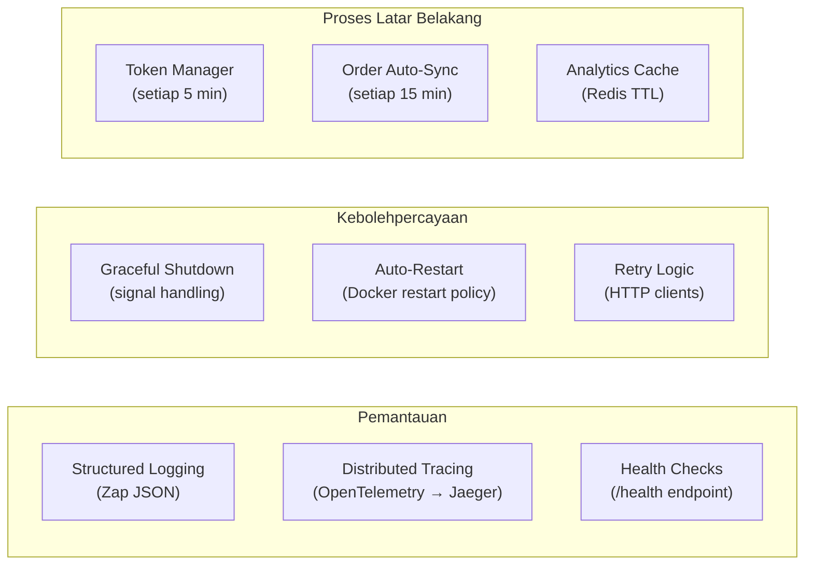

| Ciri | Penerangan |
|------|------------|
| **Structured Logging** | Semua servis menggunakan Zap JSON logger — mudah dicari dan dianalisis |
| **Distributed Tracing** | OpenTelemetry + Jaeger — jejak permintaan merentasi semua servis |
| **Health Checks** | Setiap servis mendedahkan `/health` — Docker memeriksa secara berkala |
| **Graceful Shutdown** | Menangani signal OS (SIGTERM/SIGINT) — selesaikan permintaan aktif sebelum tutup |
| **Auto-Restart** | Docker `restart: unless-stopped` — servis pulih secara automatik selepas kegagalan |
| **Background Schedulers** | Token refresh (5 min), order auto-sync (15 min), analytics cache |
| **Error Recovery** | Retry logic pada panggilan HTTP antara servis dengan exponential backoff |

---

## Aliran Sistem (System Flows)

### 1. Pengesahan & Kebenaran (Authentication & Authorization)

Sistem pengesahan menggunakan JWT dengan sesi Redis. Setiap permintaan melalui middleware yang mengesahkan token dan memeriksa peranan pengguna.

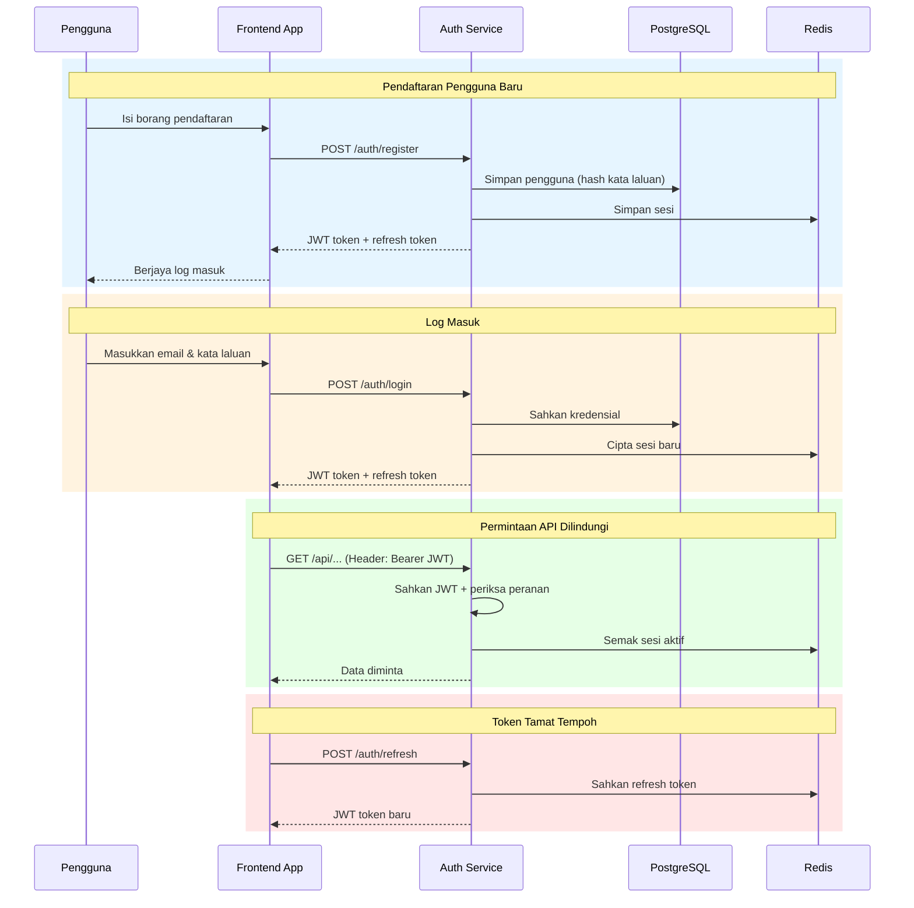

**Peranan pengguna:** `superadmin` → `admin` → `staff` → `agent` → `customer`

---

### 2. Katalog Produk (Product Catalog)

Pengurusan produk lengkap dengan sokongan varian, imej (MinIO), carian pantas (Meilisearch), dan penyegerakan automatik ke marketplace.

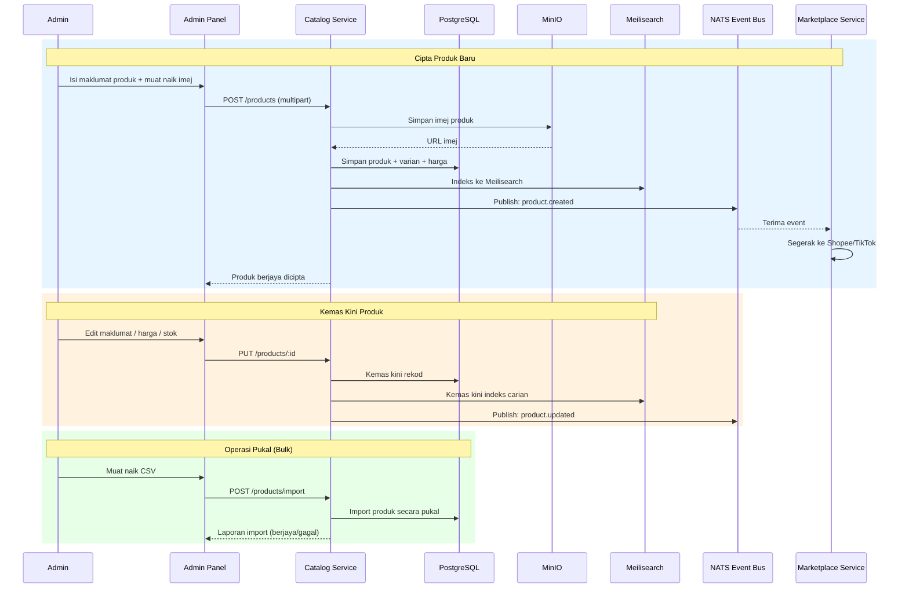

---

### 3. Pesanan Lengkap — Semua Saluran (Complete Order Flow)

Pesanan boleh datang dari 4 saluran berbeza: laman web, ejen jualan, admin manual, dan marketplace (Shopee/TikTok). Semua pesanan disatukan dalam satu sistem.

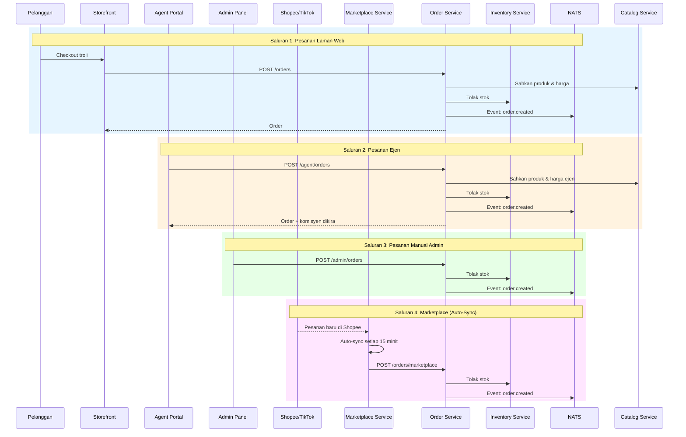

---

### 4. Kitaran Hayat Pesanan (Order Lifecycle)

Setiap pesanan melalui beberapa status dari awal hingga selesai. Status boleh dikemas kini oleh admin, sistem, atau marketplace.

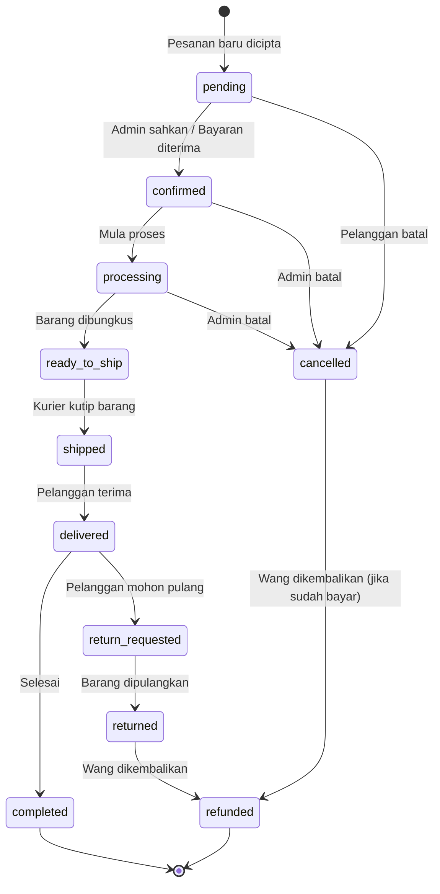

---

### 5. Inventori & Gudang (Inventory & Warehouse)

Pengurusan stok masa nyata merentasi pelbagai gudang. Stok ditolak apabila pesanan disahkan dan dipulihkan apabila dibatalkan.

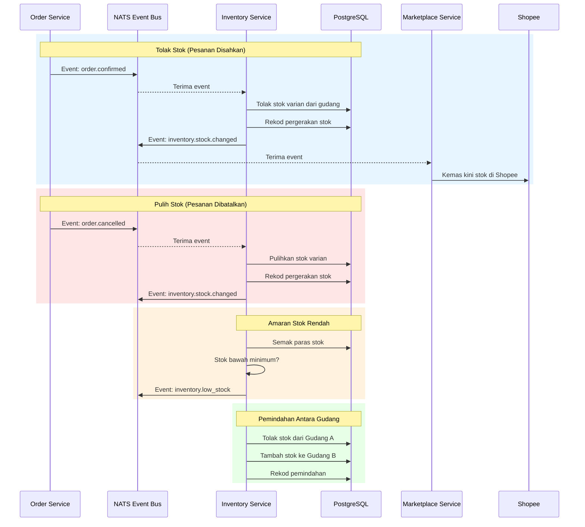

---

### 6. Integrasi Marketplace — Shopee & TikTok

Integrasi penuh dengan Shopee Open Platform dan TikTok Shop API termasuk OAuth, penyegerakan produk, pesanan automatik, dan pengurusan token.

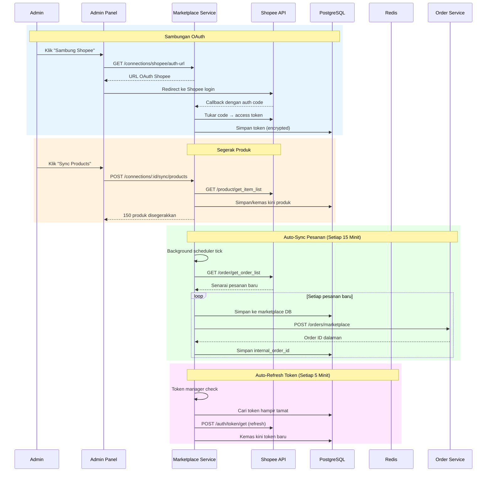

---

### 7. Pelanggan & CRM (Customer Management)

Pengurusan data pelanggan dari pelbagai saluran — storefront, ejen, dan admin manual.

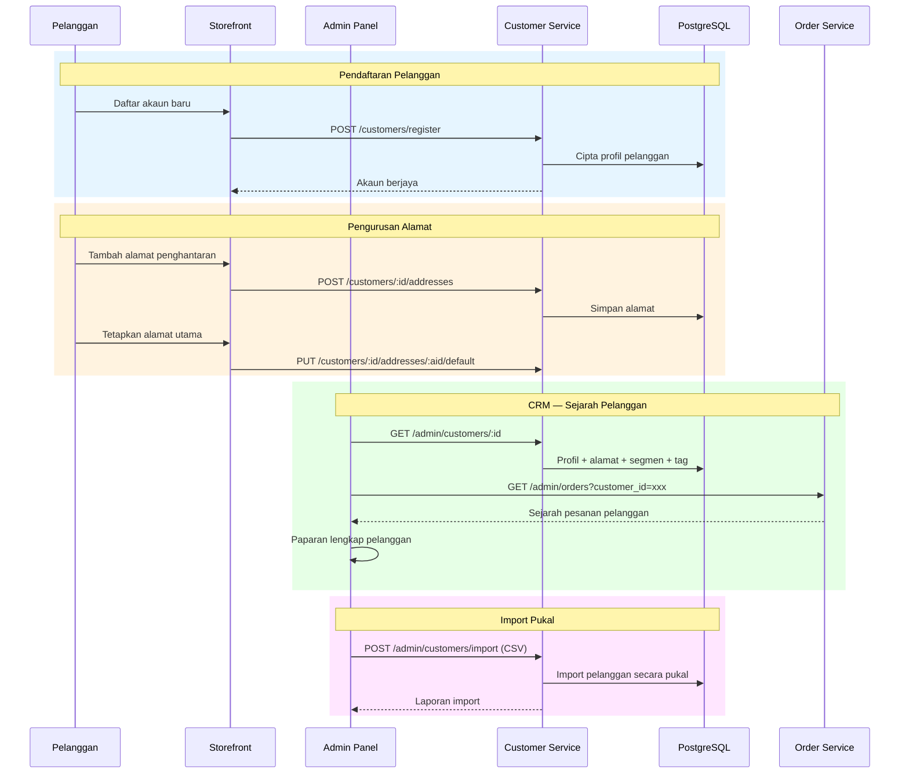

---

### 8. Sistem Ejen Jualan (Sales Agent System)

Ejen jualan berdaftar melalui admin dan boleh membuat pesanan bagi pihak pelanggan. Komisyen dikira secara automatik.

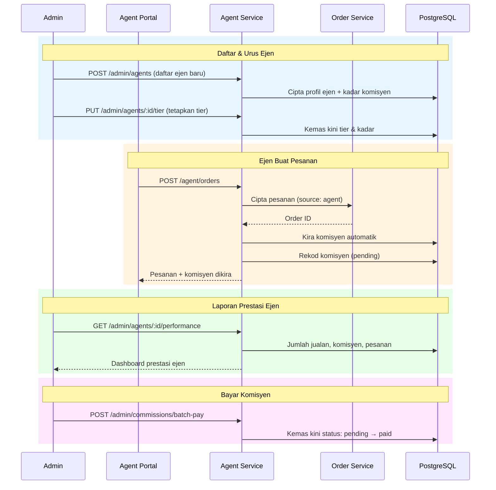

---

### 9. Sokongan & Tiket (Support Tickets)

Sistem tiket untuk menguruskan pertanyaan dan aduan pelanggan.


---

### 10. Laporan & Analitik (Reporting & Analytics)

Dashboard analitik masa nyata untuk pemantauan prestasi perniagaan.


---

### 11. Komunikasi Antara Servis (Inter-Service Communication)

Peta lengkap komunikasi antara semua perkhidmatan mikro melalui NATS Event Bus dan panggilan HTTP langsung.

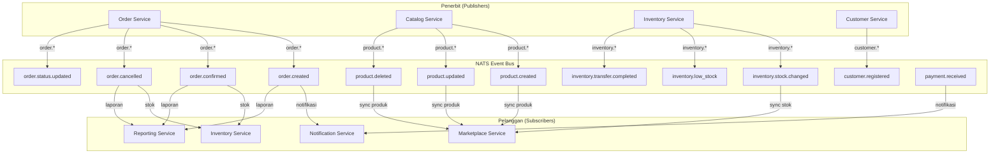

#### Panggilan HTTP Antara Servis

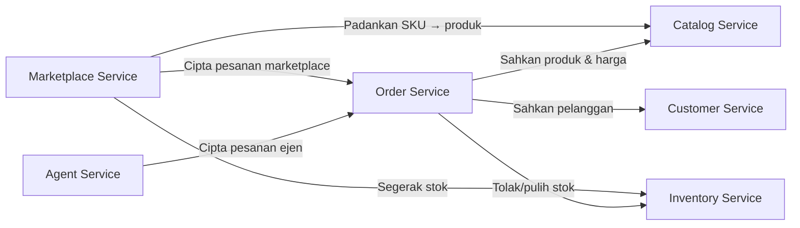

---

### 12. Aliran Pengguna — Kedai Online (Storefront User Journey)

Perjalanan pengguna lengkap dari melayari kedai sehingga pesanan selesai.

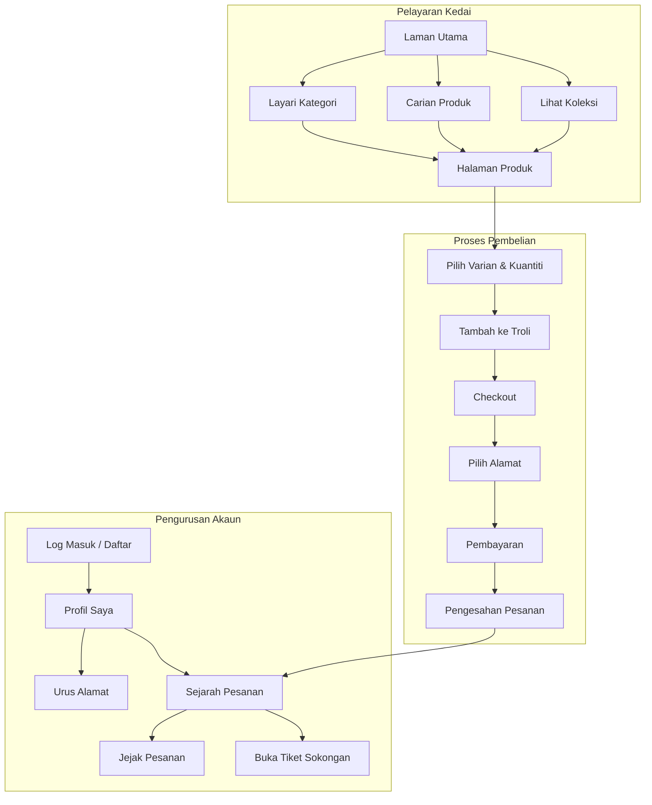

---

### 13. Aliran Pengguna — Panel Admin (Admin Dashboard Journey)

Gambaran keseluruhan modul dalam panel pentadbir yang menguruskan semua aspek perniagaan.

```mermaid
graph TB
    subgraph Dashboard["Dashboard Utama"]
        DASH["Ringkasan Jualan & Pesanan"]
    end

    subgraph Produk["Pengurusan Produk"]
        PROD_LIST["Senarai Produk"]
        PROD_ADD["Tambah Produk"]
        PROD_EDIT["Edit Produk & Varian"]
        CAT_MGMT["Kategori & Koleksi"]
        PROD_LIST --> PROD_ADD
        PROD_LIST --> PROD_EDIT
        PROD_LIST --> CAT_MGMT
    end

    subgraph Pesanan["Pengurusan Pesanan"]
        ORD_LIST["Senarai Pesanan"]
        ORD_DETAIL["Butiran Pesanan"]
        ORD_STATUS["Kemas Kini Status"]
        ORD_MANUAL["Cipta Pesanan Manual"]
        ORD_LIST --> ORD_DETAIL
        ORD_DETAIL --> ORD_STATUS
        ORD_LIST --> ORD_MANUAL
    end

    subgraph Inventori["Inventori & Gudang"]
        STOCK["Tahap Stok"]
        WAREHOUSE["Urus Gudang"]
        TRANSFER["Pemindahan Stok"]
        ALERTS["Amaran Stok Rendah"]
        STOCK --> TRANSFER
        STOCK --> ALERTS
        STOCK --> WAREHOUSE
    end

    subgraph Pelanggan["Pelanggan & CRM"]
        CUST_LIST["Senarai Pelanggan"]
        CUST_DETAIL["Profil Pelanggan"]
        CUST_SEG["Segmen & Tag"]
        CUST_IMPORT["Import CSV"]
        CUST_LIST --> CUST_DETAIL
        CUST_LIST --> CUST_SEG
        CUST_LIST --> CUST_IMPORT
    end

    subgraph Marketplace["Integrasi Marketplace"]
        MKT_CONN["Sambungan Shopee/TikTok"]
        MKT_PROD["Segerak Produk"]
        MKT_ORD["Segerak Pesanan"]
        MKT_ANALYTICS["Analitik Marketplace"]
        MKT_CONN --> MKT_PROD
        MKT_CONN --> MKT_ORD
        MKT_CONN --> MKT_ANALYTICS
    end

    subgraph Ejen["Pengurusan Ejen"]
        AGT_LIST["Senarai Ejen"]
        AGT_COMM["Komisyen & Pembayaran"]
        AGT_PERF["Prestasi Ejen"]
        AGT_LIST --> AGT_COMM
        AGT_LIST --> AGT_PERF
    end

    subgraph Laporan["Laporan & Analitik"]
        RPT_SALES["Jualan Harian/Bulanan"]
        RPT_PRODUCT["Prestasi Produk"]
        RPT_EXPORT["Eksport CSV"]
        RPT_SALES --> RPT_EXPORT
        RPT_PRODUCT --> RPT_EXPORT
    end

    subgraph Sokongan["Sokongan Pelanggan"]
        TIK_LIST["Senarai Tiket"]
        TIK_REPLY["Balas Tiket"]
        TIK_LIST --> TIK_REPLY
    end

    DASH --> Produk
    DASH --> Pesanan
    DASH --> Inventori
    DASH --> Pelanggan
    DASH --> Marketplace
    DASH --> Ejen
    DASH --> Laporan
    DASH --> Sokongan
```

---

## Deployment

Semua servis dijalankan dalam Docker containers pada satu VPS dengan konfigurasi Docker Compose.

```
  Production Infrastructure
  ════════════════════════════════════════
  Server         : 1x VPS (Linux)
  Containers     : 21 Docker containers
  Orchestration  : Docker Compose
  Reverse Proxy  : Nginx + SSL (Let's Encrypt)
  Database       : PostgreSQL 16 (9 schemas)
  Cache          : Redis 7
  Search         : Meilisearch
  Event Bus      : NATS JetStream
  Object Storage : MinIO
  Tracing        : Jaeger + OpenTelemetry
```

| Ciri Operasi | Penerangan |
|-------------|------------|
| Health Checks | Setiap servis mendedahkan `/health` — Docker memeriksa berkala |
| Structured Logging | JSON logging (Zap) — mudah dicari dan debug |
| Distributed Tracing | OpenTelemetry → Jaeger — jejak permintaan merentasi servis |
| Graceful Shutdown | Signal handling (SIGTERM) — selesaikan permintaan sebelum tutup |
| Auto-Restart | `restart: unless-stopped` — pulih automatik selepas kegagalan |
| Background Jobs | Token refresh (5 min), order sync (15 min), analytics cache |

---

<div align="center">

**Direka & dibina sepenuhnya oleh Muhammad Luqman**

Solo Full-Stack Developer & System Architect

*Go, Next.js, PostgreSQL, Docker, dan semangat batik Malaysia*

Terengganu, Malaysia

</div>
