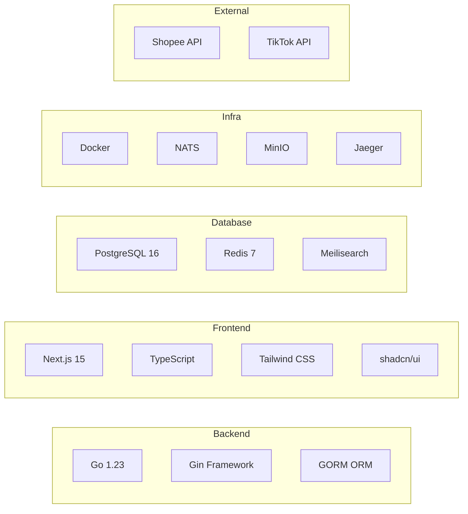
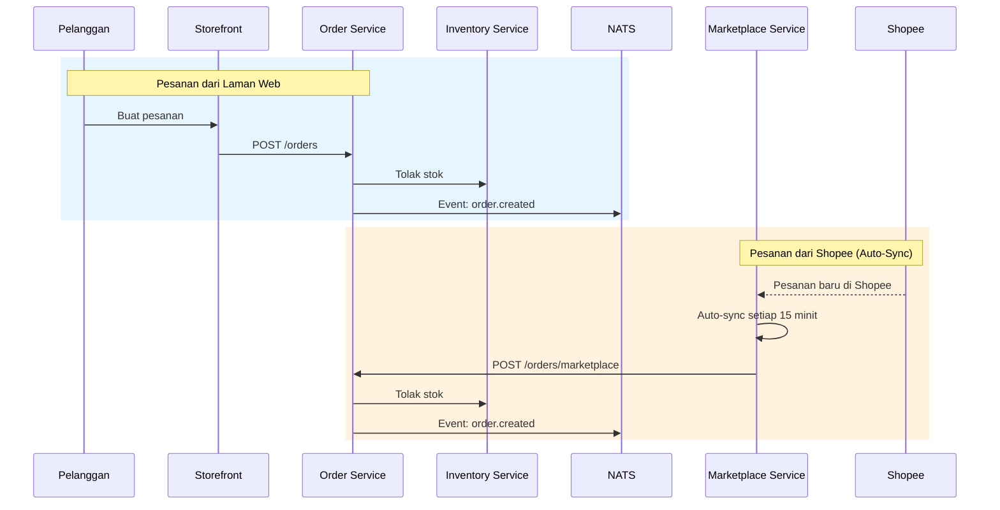

<div align="center">

# Kilang Desa Murni Batik

**Platform E-Dagang Lengkap untuk Batik Malaysia**

*Full-stack e-commerce platform powering a traditional Malaysian batik factory's digital operations*

[]()
[]()
[]()
[]()

</div>

---

## Tentang Projek

Kilang Desa Murni Batik ialah platform digital hujung-ke-hujung (*end-to-end*) yang menghubungkan kilang batik tradisional dengan pembeli moden. Sistem ini mengurus keseluruhan operasi perniagaan — dari pengurusan katalog produk, pemprosesan pesanan, penjejakan inventori, hingga integrasi marketplace seperti Shopee dan TikTok Shop.

Dibina dari awal menggunakan seni bina **perkhidmatan mikro (microservices)** dengan 10 backend services, 4 frontend apps, dan 21 Docker containers dalam production.

---

## Seni Bina Sistem


---

## Ciri-Ciri Utama

### Kedai Online (Storefront)
| Ciri | Penerangan |
|------|------------|
| Katalog Produk | Paparan produk dengan carian pantas Meilisearch, penapis kategori & koleksi |
| Troli Beli-belah | Tambah ke troli, kemaskini kuantiti, checkout serta-merta |
| Pembayaran | Integrasi gateway pembayaran dengan penjejakan status |
| Akaun Pelanggan | Pendaftaran, log masuk, sejarah pesanan, alamat tersimpan |
| Responsif | Dioptimumkan untuk telefon bimbit dan desktop |

### Panel Admin (Dashboard)
| Ciri | Penerangan |
|------|------------|
| Pengurusan Pesanan | Lihat, proses, dan jejak semua pesanan dari semua saluran |
| Pengurusan Produk | CRUD produk, varian, imej, dan harga |
| Inventori | Penjejakan stok masa nyata, amaran stok rendah, pemindahan gudang |
| Pelanggan & CRM | Senarai pelanggan, sejarah pembelian, segmentasi |
| Laporan & Analitik | Jualan harian/bulanan, produk terlaris, prestasi ejen |
| Integrasi Shopee | Sambung kedai Shopee, segerak produk & pesanan automatik |
| Pengurusan Ejen | Daftar ejen, tetapkan komisyen, jejak prestasi |
| Sokongan Pelanggan | Sistem tiket untuk pertanyaan dan aduan |

### Integrasi Marketplace
| Ciri | Penerangan |
|------|------------|
| Shopee Open Platform | OAuth, segerak produk, segerak pesanan automatik setiap 15 minit |
| TikTok Shop | Integrasi API untuk pengurusan produk dan pesanan |
| Penyegerakan Stok | Kemas kini stok merentasi semua saluran jualan secara automatik |
| Pengurusan Token | Auto-refresh token OAuth sebelum tamat tempoh |

### Sistem Ejen
| Ciri | Penerangan |
|------|------------|
| Portal Ejen | Dashboard khusus untuk ejen membuat pesanan |
| Komisyen Automatik | Pengiraan dan penjejakan komisyen berdasarkan jualan |
| Katalog Ejen | Akses produk dengan harga ejen khas |

---

## Tech Stack



| Lapisan | Teknologi | Tujuan |
|---------|-----------|--------|
| **Bahasa Backend** | Go 1.23 | Perkhidmatan mikro berprestasi tinggi |
| **Framework Web** | Gin | HTTP router & middleware |
| **ORM** | GORM | Interaksi pangkalan data |
| **Bahasa Frontend** | TypeScript | Keselamatan jenis (*type safety*) |
| **Framework UI** | Next.js 15 (App Router) | SSR, routing, API proxy |
| **Komponen UI** | shadcn/ui + Tailwind CSS | Antara muka pengguna moden |
| **Pangkalan Data** | PostgreSQL 16 | Data utama dengan skema khusus |
| **Cache** | Redis 7 | Cache sesi, analitik, token |
| **Carian** | Meilisearch | Carian produk pantas (*full-text*) |
| **Message Broker** | NATS | Komunikasi antara servis (event-driven) |
| **Storan Objek** | MinIO | Imej produk, dokumen |
| **Tracing** | Jaeger + OpenTelemetry | Penjejakan permintaan teragih |
| **Reverse Proxy** | Nginx | SSL termination, load balancing |
| **Kontena** | Docker Compose | Orkestrasi 21 kontena |

---

## Statistik Kod

```
  Jumlah Kod Sumber
  ═══════════════════════════════════════
  Backend (Go)         : 115,160 baris  │  493 fail
  Frontend (TypeScript): 135,836 baris  │  589 fail
  ─────────────────────────────────────
  JUMLAH               : 250,996 baris  │ 1,082 fail
```

### Backend — 10 Perkhidmatan Mikro

| Perkhidmatan | Baris Kod | Penerangan |
|-------------|-----------|------------|
| `service-catalog` | 28,526 | Pengurusan produk, kategori, koleksi, carian |
| `service-order` | 26,681 | Pesanan, pembayaran, penghantaran, aliran kerja |
| `service-marketplace` | 14,421 | Integrasi Shopee & TikTok, auto-sync |
| `service-inventory` | 10,924 | Stok, gudang, pemindahan, amaran |
| `service-auth` | 8,428 | Pengesahan JWT, sesi, peranan |
| `service-customer` | 7,625 | Profil pelanggan, alamat, CRM |
| `service-agent` | 7,044 | Ejen jualan, komisyen, pesanan ejen |
| `service-reporting` | 4,669 | Laporan jualan, analitik, eksport |
| `service-support` | 4,566 | Tiket sokongan, pertanyaan pelanggan |
| `service-notification` | 2,276 | Notifikasi email & mesej |

### Frontend — 4 Aplikasi

| Aplikasi | Baris Kod | Penerangan |
|----------|-----------|------------|
| `frontend-admin` | 74,007 | Panel pentadbir penuh |
| `frontend-storefront` | 54,325 | Kedai online pelanggan |
| `frontend-agent` | 3,981 | Portal ejen jualan |
| `frontend-warehouse` | 3,523 | Pengurusan gudang |

### Infrastruktur

| Komponen | Bilangan |
|----------|----------|
| API Endpoints | 800+ |
| Model Pangkalan Data | 254 |
| Docker Containers | 21 |
| Git Repositories | 22 |
| Skema PostgreSQL | `auth`, `catalog`, `inventory`, `sales`, `customer`, `agent`, `marketplace`, `support`, `reporting` |

---

## Aliran Pesanan



---

## Deployment

Semua servis dijalankan dalam Docker containers pada satu VPS dengan konfigurasi Docker Compose. Setiap servis mempunyai:

- Health checks automatik
- Structured JSON logging (Zap)
- Distributed tracing (OpenTelemetry → Jaeger)
- Graceful shutdown handling
- Auto-restart on failure

---

<div align="center">

**Dibina dengan Go, Next.js, dan semangat batik Malaysia**

Terengganu, Malaysia

</div>
