<div align="center">

# Kilang Desa Murni Batik

**Complete E-Commerce Platform for Malaysian Batik**

*Full-stack e-commerce platform powering a traditional Malaysian batik factory's digital operations*

[]()
[]()
[]()
[]()
[]()
[]()

**Designed, built, and maintained entirely by a solo developer**

</div>

---

## Developer

| | |
|---|---|
| **Name** | **Muhammad Luqman** |
| **Role** | Solo Full-Stack Developer & System Architect |
| **Scope** | Architecture design, backend & frontend development, database design, external API integration, DevOps & deployment, infrastructure management |
| **Location** | Terengganu, Malaysia |

> This entire platform — from designing the microservices architecture, developing 10 backend services in Go, 4 frontend apps in Next.js/TypeScript, designing 9 database schemas with 254 models, integrating Shopee & TikTok APIs, to deploying 21 Docker containers in production — was built entirely solo by a single developer.

---

## About the Project

Kilang Desa Murni Batik is an end-to-end digital platform that connects a traditional batik factory with modern buyers. The system manages all business operations — from product catalog management, order processing, inventory tracking, to marketplace integration with Shopee and TikTok Shop.

Built from scratch using a **microservices architecture** with 10 backend services, 4 frontend apps, and 21 Docker containers in production.

---

## System Architecture

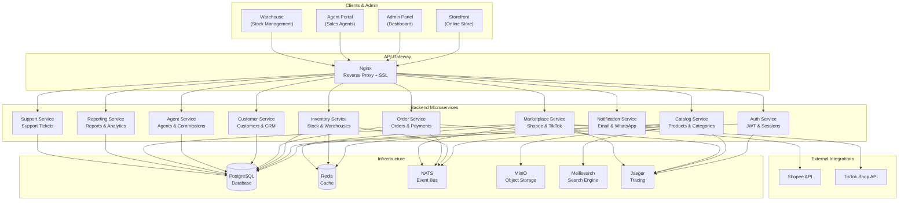
```mermaid
graph TB
    subgraph Clients["Clients & Admin"]
        ST["Storefront<br/>(Online Store)"]
        AD["Admin Panel<br/>(Dashboard)"]
        AG["Agent Portal<br/>(Sales Agents)"]
        WH["Warehouse<br/>(Stock Management)"]
    end

    subgraph Gateway["API Gateway"]
        NG["Nginx<br/>Reverse Proxy + SSL"]
    end

    subgraph Backend["Backend Microservices"]
        AUTH["Auth Service<br/>JWT & Sessions"]
        CAT["Catalog Service<br/>Products & Categories"]
        INV["Inventory Service<br/>Stock & Warehouses"]
        ORD["Order Service<br/>Orders & Payments"]
        CUST["Customer Service<br/>Customers & CRM"]
        AGENT["Agent Service<br/>Agents & Commissions"]
        MKT["Marketplace Service<br/>Shopee & TikTok"]
        NOTIF["Notification Service<br/>Email & WhatsApp"]
        RPT["Reporting Service<br/>Reports & Analytics"]
        SUP["Support Service<br/>Support Tickets"]
    end

    subgraph Infrastructure["Infrastructure"]
        PG[("PostgreSQL<br/>Database")]
        RD[("Redis<br/>Cache")]
        NATS["NATS<br/>Event Bus"]
        MINIO["MinIO<br/>Object Storage"]
        MS["Meilisearch<br/>Search Engine"]
        JG["Jaeger<br/>Tracing"]
    end

    subgraph External["External Integrations"]
        SHOPEE["Shopee API"]
        TIKTOK["TikTok Shop API"]
    end

    ST & AD & AG & WH --> NG
    NG --> AUTH & CAT & INV & ORD & CUST & AGENT & MKT & NOTIF & RPT & SUP

    AUTH & CAT & INV & ORD & CUST & AGENT & MKT & RPT & SUP --> PG
    CAT & INV & MKT --> RD
    CAT & INV & ORD & MKT --> NATS
    CAT --> MINIO
    CAT --> MS
    AUTH & CAT & ORD & MKT --> JG

    MKT --> SHOPEE & TIKTOK
```

---

## Key Features

### Online Store (Storefront)
| Feature | Description |
|---------|-------------|
| Product Catalog | Product display with fast Meilisearch search, category & collection filters |
| Shopping Cart | Add to cart, update quantity, instant checkout |
| Payments | Payment gateway integration with status tracking |
| Customer Accounts | Registration, login, order history, saved addresses |
| Responsive | Optimized for mobile and desktop |

### Admin Panel (Dashboard)
| Feature | Description |
|---------|-------------|
| Order Management | View, process, and track all orders from all channels |
| Product Management | CRUD products, variants, images, and pricing |
| Inventory | Real-time stock tracking, low stock alerts, warehouse transfers |
| Customers & CRM | Customer list, purchase history, segmentation |
| Reports & Analytics | Daily/monthly sales, best-selling products, agent performance |
| Shopee Integration | Connect Shopee store, auto-sync products & orders |
| Agent Management | Register agents, set commissions, track performance |
| Customer Support | Ticket system for inquiries and complaints |

### Marketplace Integration
| Feature | Description |
|---------|-------------|
| Shopee Open Platform | OAuth, product sync, automatic order sync every 15 minutes |
| TikTok Shop | API integration for product and order management |
| Stock Synchronization | Automatic stock updates across all sales channels |
| Token Management | Auto-refresh OAuth tokens before expiry |

### Agent System
| Feature | Description |
|---------|-------------|
| Agent Portal | Dedicated dashboard for agents to place orders |
| Automatic Commissions | Commission calculation and tracking based on sales |
| Agent Catalog | Product access with special agent pricing |

---

## Tech Stack

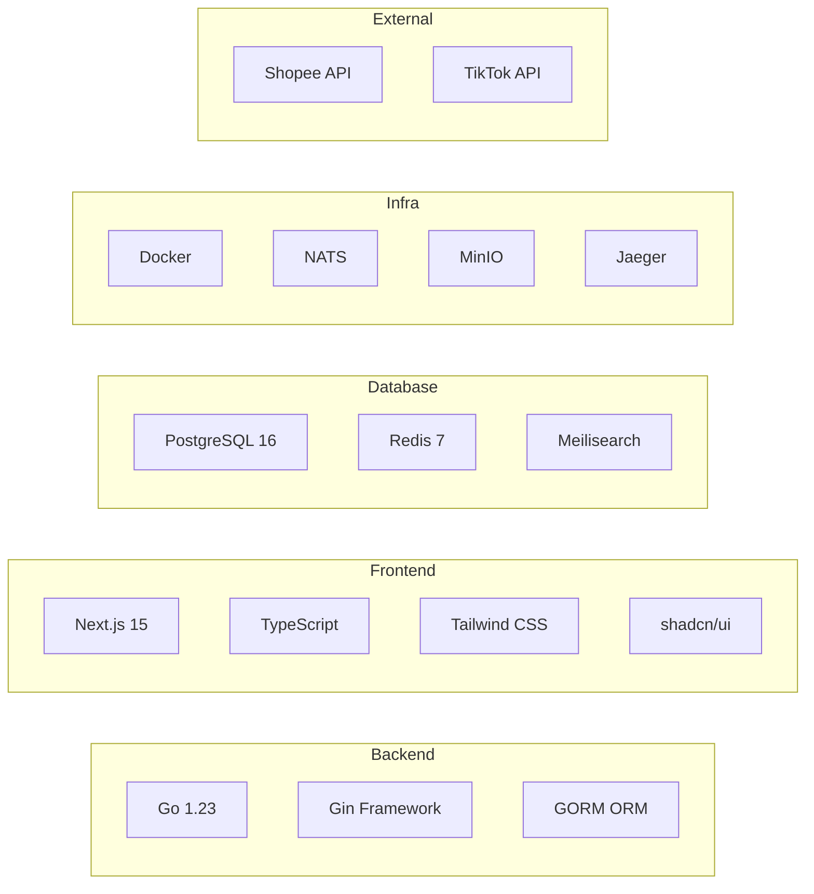
```mermaid
graph LR
    subgraph Backend
        GO["Go 1.23"]
        GIN["Gin Framework"]
        GORM["GORM ORM"]
    end

    subgraph Frontend
        NEXT["Next.js 15"]
        TS["TypeScript"]
        TW["Tailwind CSS"]
        SC["shadcn/ui"]
    end

    subgraph Database
        PG["PostgreSQL 16"]
        RD["Redis 7"]
        MS["Meilisearch"]
    end

    subgraph Infra
        DOCKER["Docker"]
        NATS["NATS"]
        MINIO["MinIO"]
        JAEGER["Jaeger"]
    end

    subgraph External
        SHOPEE["Shopee API"]
        TIKTOK["TikTok API"]
    end
```

| Layer | Technology | Purpose |
|-------|------------|---------|
| **Backend Language** | Go 1.23 | High-performance microservices |
| **Web Framework** | Gin | HTTP router & middleware |
| **ORM** | GORM | Database interaction |
| **Frontend Language** | TypeScript | Type safety |
| **UI Framework** | Next.js 15 (App Router) | SSR, routing, API proxy |
| **UI Components** | shadcn/ui + Tailwind CSS | Modern user interface |
| **Database** | PostgreSQL 16 | Primary data store with dedicated schemas |
| **Cache** | Redis 7 | Session cache, analytics, tokens |
| **Search** | Meilisearch | Fast full-text product search |
| **Message Broker** | NATS | Inter-service communication (event-driven) |
| **Object Storage** | MinIO | Product images, documents |
| **Tracing** | Jaeger + OpenTelemetry | Distributed request tracing |
| **Reverse Proxy** | Nginx | SSL termination, load balancing |
| **Containers** | Docker Compose | Orchestration of 21 containers |

---

## Code Statistics

```
  Source Code Total
  ═══════════════════════════════════════
  Backend (Go)         : 115,160 lines  │  493 files
  Frontend (TypeScript): 135,836 lines  │  589 files
  ─────────────────────────────────────
  TOTAL                : 250,996 lines  │ 1,082 files
```

### Backend — 10 Microservices

| Service | Lines of Code | Description |
|---------|---------------|-------------|
| `service-catalog` | 28,526 | Product management, categories, collections, search |
| `service-order` | 26,681 | Orders, payments, shipping, workflows |
| `service-marketplace` | 14,421 | Shopee & TikTok integration, auto-sync |
| `service-inventory` | 10,924 | Stock, warehouses, transfers, alerts |
| `service-auth` | 8,428 | JWT authentication, sessions, roles |
| `service-customer` | 7,625 | Customer profiles, addresses, CRM |
| `service-agent` | 7,044 | Sales agents, commissions, agent orders |
| `service-reporting` | 4,669 | Sales reports, analytics, exports |
| `service-support` | 4,566 | Support tickets, customer inquiries |
| `service-notification` | 2,276 | Email & message notifications |

### Frontend — 4 Applications

| Application | Lines of Code | Description |
|-------------|---------------|-------------|
| `frontend-admin` | 74,007 | Full admin panel |
| `frontend-storefront` | 54,325 | Customer online store |
| `frontend-agent` | 3,981 | Sales agent portal |
| `frontend-warehouse` | 3,523 | Warehouse management |

### Infrastructure

| Component | Count |
|-----------|-------|
| API Endpoints | 800+ |
| Database Models | 254 |
| Docker Containers | 21 |
| Git Repositories | 22 |
| PostgreSQL Schemas | `auth`, `catalog`, `inventory`, `sales`, `customer`, `agent`, `marketplace`, `support`, `reporting` |

---

## Database Design

A single PostgreSQL database with 9 separate schemas — each microservice owns its own schema for data isolation (*schema-per-service pattern*).

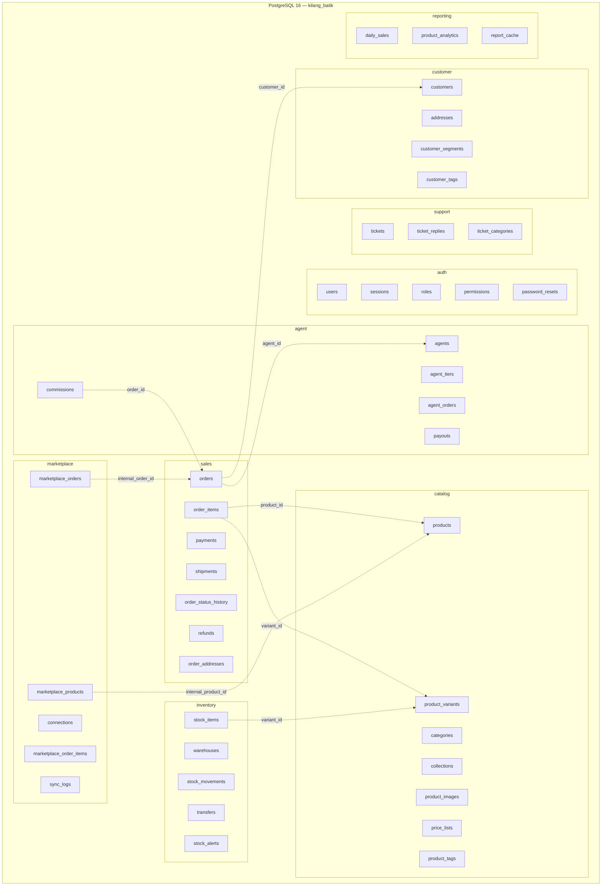
```mermaid
graph TB
    subgraph PostgreSQL["PostgreSQL 16 — kilang_batik"]
        subgraph auth_schema["auth"]
            AU_1["users"]
            AU_2["sessions"]
            AU_3["roles"]
            AU_4["permissions"]
            AU_5["password_resets"]
        end

        subgraph catalog_schema["catalog"]
            CA_1["products"]
            CA_2["product_variants"]
            CA_3["categories"]
            CA_4["collections"]
            CA_5["product_images"]
            CA_6["price_lists"]
            CA_7["product_tags"]
        end

        subgraph sales_schema["sales"]
            SA_1["orders"]
            SA_2["order_items"]
            SA_3["payments"]
            SA_4["shipments"]
            SA_5["order_status_history"]
            SA_6["refunds"]
            SA_7["order_addresses"]
        end

        subgraph inventory_schema["inventory"]
            IN_1["warehouses"]
            IN_2["stock_items"]
            IN_3["stock_movements"]
            IN_4["transfers"]
            IN_5["stock_alerts"]
        end

        subgraph customer_schema["customer"]
            CU_1["customers"]
            CU_2["addresses"]
            CU_3["customer_segments"]
            CU_4["customer_tags"]
        end

        subgraph agent_schema["agent"]
            AG_1["agents"]
            AG_2["agent_tiers"]
            AG_3["commissions"]
            AG_4["agent_orders"]
            AG_5["payouts"]
        end

        subgraph marketplace_schema["marketplace"]
            MK_1["connections"]
            MK_2["marketplace_products"]
            MK_3["marketplace_orders"]
            MK_4["marketplace_order_items"]
            MK_5["sync_logs"]
        end

        subgraph support_schema["support"]
            SU_1["tickets"]
            SU_2["ticket_replies"]
            SU_3["ticket_categories"]
        end

        subgraph reporting_schema["reporting"]
            RE_1["daily_sales"]
            RE_2["product_analytics"]
            RE_3["report_cache"]
        end
    end

    SA_1 -.->|"customer_id"| CU_1
    SA_1 -.->|"agent_id"| AG_1
    SA_2 -.->|"product_id"| CA_1
    SA_2 -.->|"variant_id"| CA_2
    IN_2 -.->|"variant_id"| CA_2
    AG_3 -.->|"order_id"| SA_1
    MK_3 -.->|"internal_order_id"| SA_1
    MK_2 -.->|"internal_product_id"| CA_1
```

### Database Features

| Feature | Description |
|---------|-------------|
| Schema-per-Service | Each service owns its own schema — clear data isolation |
| Foreign Key Constraints | Cross-schema references for data integrity |
| Check Constraints | DB-level validation (e.g., order amounts must be positive) |
| Optimized Indexes | B-tree, GIN, and partial indexes for query performance |
| UUID Primary Keys | Every record uses UUID v4 — safe for distributed systems |
| Soft Deletes | Records are not deleted, only marked with `deleted_at` |
| Audit Columns | `created_at`, `updated_at`, `created_by` on every table |
| GORM AutoMigrate | Automatic migration on service startup |

---

## Security

| Layer | Practice |
|-------|----------|
| **Authentication** | JWT (access + refresh token) with Redis sessions |
| **Passwords** | bcrypt hashing with cost factor 12 |
| **Authorization** | Role-Based Access Control (RBAC) — 5 layered roles |
| **API Protection** | Auth middleware on all protected endpoints |
| **OAuth Tokens** | Encrypted (AES-256) before storing in DB |
| **CORS** | Strict configuration — only allowed domains |
| **Input Validation** | Input validation on every handler (Gin binding) |
| **SQL Injection** | Prevented by GORM parameterized queries |
| **Rate Limiting** | Rate limits on sensitive endpoints |
| **HTTPS** | SSL/TLS termination at Nginx (Let's Encrypt) |
| **Env Secrets** | Secrets stored as env vars, not in code |

---

## Technical Challenges & Solutions

Key technical challenges solved during the development of this platform:

### 1. Marketplace Order Sync with Shopee Discounts
**Problem:** Shopee allows vouchers/discounts that make order totals lower than the item subtotal. This caused `shipping_cost` to become negative, violating a check constraint in PostgreSQL.

**Solution:** Smart logic in `CreateMarketplaceOrder` — when `TotalAmount < subtotal`, the system calculates the difference as a `discount` and sets `shipping_cost = 0`, avoiding negative values.

### 2. Event-Driven Architecture with NATS JetStream
**Problem:** Services need to communicate asynchronously without tight coupling. For example: when an order is created, inventory needs to be updated and notifications need to be sent — without Order Service needing to know about both services.

**Solution:** Implemented NATS JetStream as the event bus. Each service publishes events, and other services subscribe independently. 22+ event types across the system.

### 3. Shopee OAuth Token Expiry Management
**Problem:** Shopee OAuth tokens expire every 4 hours. If a token expires during auto-sync, all operations would fail.

**Solution:** Background token manager that checks tokens every 5 minutes and automatically refreshes them 30 minutes before expiry — ensuring tokens are always active.

### 4. SKU Matching Across Platforms
**Problem:** Products on Shopee have different SKUs from the internal system. Shopee orders need to be linked to internal products for inventory tracking.

**Solution:** SKU matching system in Marketplace Service that maps `external_sku` to `internal_product_id` during product sync, enabling stock tracking across all channels.

### 5. One Database, 9 Separate Schemas
**Problem:** How to isolate data for 10 microservices without running 10 separate databases (too much overhead for a single VPS).

**Solution:** Schema-per-service pattern — one PostgreSQL database with 9 separate schemas. Each service only accesses its own schema, but can still cross-reference via foreign keys when needed.

---

## Monitoring & Reliability

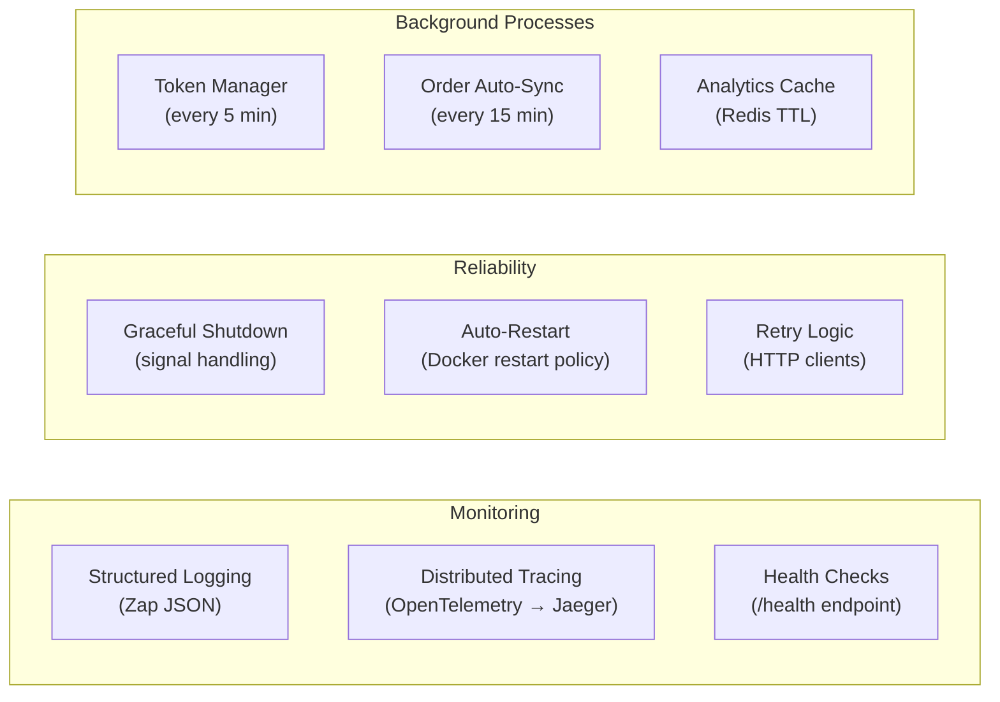
```mermaid
graph LR
    subgraph Observability["Monitoring"]
        LOG["Structured Logging<br/>(Zap JSON)"]
        TRACE["Distributed Tracing<br/>(OpenTelemetry → Jaeger)"]
        HEALTH["Health Checks<br/>(/health endpoint)"]
    end

    subgraph Reliability["Reliability"]
        GRACEFUL["Graceful Shutdown<br/>(signal handling)"]
        RESTART["Auto-Restart<br/>(Docker restart policy)"]
        RETRY["Retry Logic<br/>(HTTP clients)"]
    end

    subgraph Background["Background Processes"]
        TOKEN["Token Manager<br/>(every 5 min)"]
        SYNC["Order Auto-Sync<br/>(every 15 min)"]
        CACHE["Analytics Cache<br/>(Redis TTL)"]
    end
```

| Feature | Description |
|---------|-------------|
| **Structured Logging** | All services use Zap JSON logger — easy to search and analyze |
| **Distributed Tracing** | OpenTelemetry + Jaeger — trace requests across all services |
| **Health Checks** | Every service exposes `/health` — Docker checks periodically |
| **Graceful Shutdown** | Handles OS signals (SIGTERM/SIGINT) — completes active requests before shutting down |
| **Auto-Restart** | Docker `restart: unless-stopped` — services recover automatically after failure |
| **Background Schedulers** | Token refresh (5 min), order auto-sync (15 min), analytics cache |
| **Error Recovery** | Retry logic on inter-service HTTP calls with exponential backoff |

---

## System Flows

### 1. Authentication & Authorization

The authentication system uses JWT with Redis sessions. Every request goes through middleware that validates the token and checks user roles.

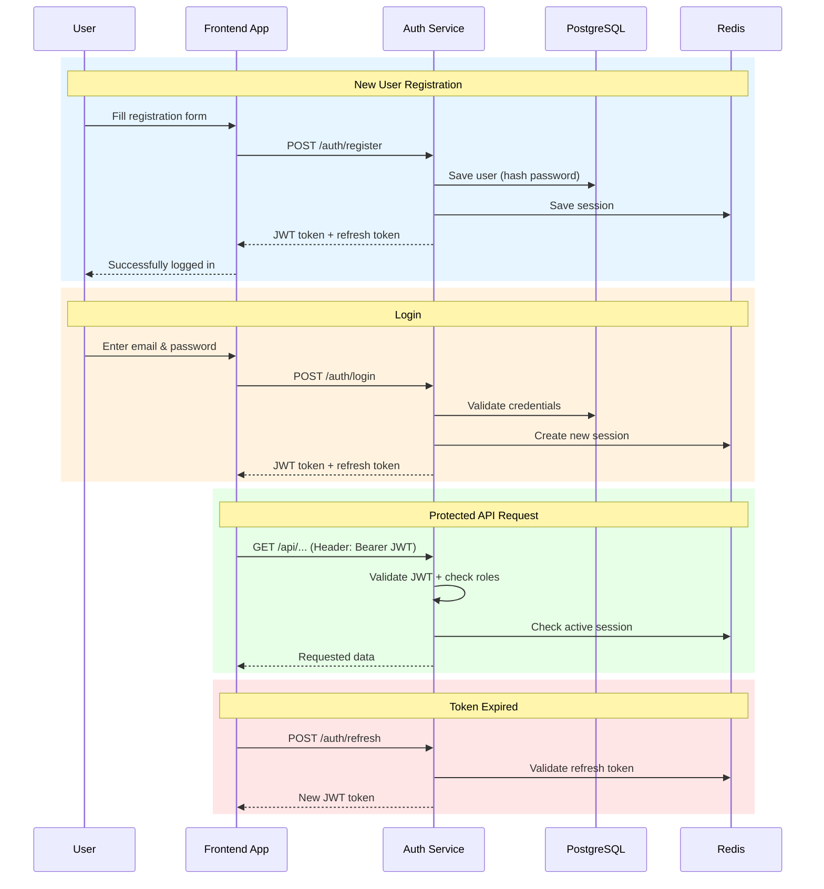
```mermaid
sequenceDiagram
    participant U as User
    participant FE as Frontend App
    participant AUTH as Auth Service
    participant DB as PostgreSQL
    participant RD as Redis

    rect rgb(230, 245, 255)
    Note over U,RD: New User Registration
    U->>FE: Fill registration form
    FE->>AUTH: POST /auth/register
    AUTH->>DB: Save user (hash password)
    AUTH->>RD: Save session
    AUTH-->>FE: JWT token + refresh token
    FE-->>U: Successfully logged in
    end

    rect rgb(255, 243, 224)
    Note over U,RD: Login
    U->>FE: Enter email & password
    FE->>AUTH: POST /auth/login
    AUTH->>DB: Validate credentials
    AUTH->>RD: Create new session
    AUTH-->>FE: JWT token + refresh token
    end

    rect rgb(230, 255, 230)
    Note over FE,RD: Protected API Request
    FE->>AUTH: GET /api/... (Header: Bearer JWT)
    AUTH->>AUTH: Validate JWT + check roles
    AUTH->>RD: Check active session
    AUTH-->>FE: Requested data
    end

    rect rgb(255, 230, 230)
    Note over FE,RD: Token Expired
    FE->>AUTH: POST /auth/refresh
    AUTH->>RD: Validate refresh token
    AUTH-->>FE: New JWT token
    end
```

**User roles:** `superadmin` → `admin` → `staff` → `agent` → `customer`

---

### 2. Product Catalog

Complete product management with variant support, images (MinIO), fast search (Meilisearch), and automatic marketplace sync.

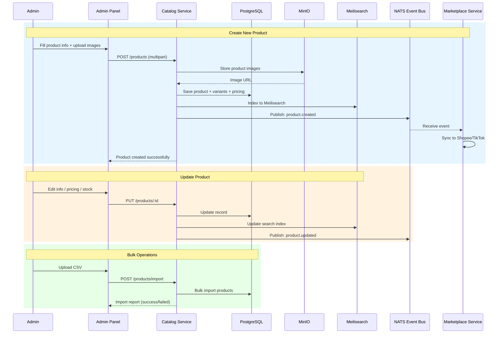
```mermaid
sequenceDiagram
    participant A as Admin
    participant FE as Admin Panel
    participant CAT as Catalog Service
    participant DB as PostgreSQL
    participant MIO as MinIO
    participant MS as Meilisearch
    participant NATS as NATS Event Bus
    participant MKT as Marketplace Service

    rect rgb(230, 245, 255)
    Note over A,MKT: Create New Product
    A->>FE: Fill product info + upload images
    FE->>CAT: POST /products (multipart)
    CAT->>MIO: Store product images
    MIO-->>CAT: Image URL
    CAT->>DB: Save product + variants + pricing
    CAT->>MS: Index to Meilisearch
    CAT->>NATS: Publish: product.created
    NATS-->>MKT: Receive event
    MKT->>MKT: Sync to Shopee/TikTok
    CAT-->>FE: Product created successfully
    end

    rect rgb(255, 243, 224)
    Note over A,MS: Update Product
    A->>FE: Edit info / pricing / stock
    FE->>CAT: PUT /products/:id
    CAT->>DB: Update record
    CAT->>MS: Update search index
    CAT->>NATS: Publish: product.updated
    end

    rect rgb(230, 255, 230)
    Note over A,DB: Bulk Operations
    A->>FE: Upload CSV
    FE->>CAT: POST /products/import
    CAT->>DB: Bulk import products
    CAT-->>FE: Import report (success/failed)
    end
```

---

### 3. Complete Order Flow — All Channels

Orders can come from 4 different channels: website, sales agents, manual admin entry, and marketplace (Shopee/TikTok). All orders are unified in a single system.


```mermaid
sequenceDiagram
    participant P as Customer
    participant ST as Storefront
    participant AG as Agent Portal
    participant AD as Admin Panel
    participant SH as Shopee/TikTok
    participant MKT as Marketplace Service
    participant ORD as Order Service
    participant INV as Inventory Service
    participant NATS as NATS
    participant CAT as Catalog Service

    rect rgb(230, 245, 255)
    Note over P,NATS: Channel 1: Website Order
    P->>ST: Checkout cart
    ST->>ORD: POST /orders
    ORD->>CAT: Validate products & pricing
    ORD->>INV: Deduct stock
    ORD->>NATS: Event: order.created
    ORD-->>ST: Order #KDM-20250208-001
    end

    rect rgb(255, 243, 224)
    Note over AG,NATS: Channel 2: Agent Order
    AG->>ORD: POST /agent/orders
    ORD->>CAT: Validate products & agent pricing
    ORD->>INV: Deduct stock
    ORD->>NATS: Event: order.created
    ORD-->>AG: Order + commission calculated
    end

    rect rgb(230, 255, 230)
    Note over AD,NATS: Channel 3: Manual Admin Order
    AD->>ORD: POST /admin/orders
    ORD->>INV: Deduct stock
    ORD->>NATS: Event: order.created
    end

    rect rgb(255, 230, 255)
    Note over SH,NATS: Channel 4: Marketplace (Auto-Sync)
    SH-->>MKT: New order on Shopee
    MKT->>MKT: Auto-sync every 15 minutes
    MKT->>ORD: POST /orders/marketplace
    ORD->>INV: Deduct stock
    ORD->>NATS: Event: order.created
    end
```

---

### 4. Order Lifecycle

Every order goes through several statuses from start to completion. Status can be updated by admin, system, or marketplace.

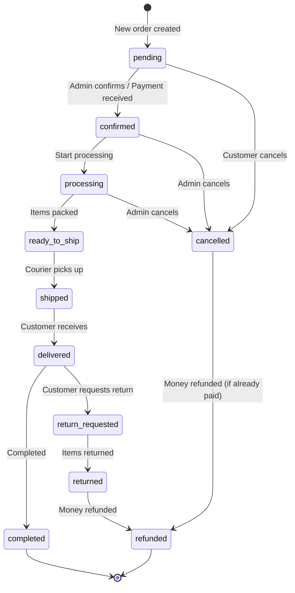
```mermaid
stateDiagram-v2
    [*] --> pending: New order created

    pending --> confirmed: Admin confirms / Payment received
    pending --> cancelled: Customer cancels

    confirmed --> processing: Start processing
    confirmed --> cancelled: Admin cancels

    processing --> ready_to_ship: Items packed
    processing --> cancelled: Admin cancels

    ready_to_ship --> shipped: Courier picks up
    shipped --> delivered: Customer receives

    delivered --> completed: Completed
    delivered --> return_requested: Customer requests return

    return_requested --> returned: Items returned
    returned --> refunded: Money refunded

    cancelled --> refunded: Money refunded (if already paid)

    completed --> [*]
    refunded --> [*]
```

---

### 5. Inventory & Warehouse

Real-time stock management across multiple warehouses. Stock is deducted when orders are confirmed and restored when cancelled.

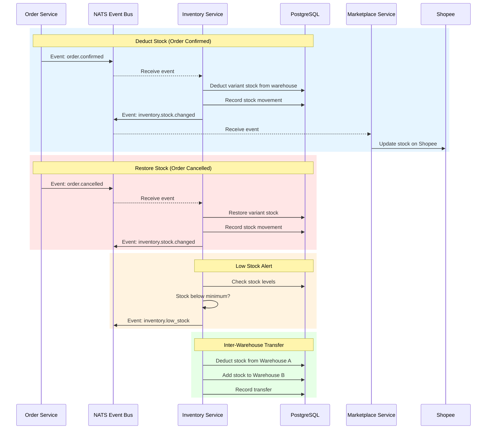
```mermaid
sequenceDiagram
    participant ORD as Order Service
    participant NATS as NATS Event Bus
    participant INV as Inventory Service
    participant DB as PostgreSQL
    participant MKT as Marketplace Service
    participant SH as Shopee

    rect rgb(230, 245, 255)
    Note over ORD,DB: Deduct Stock (Order Confirmed)
    ORD->>NATS: Event: order.confirmed
    NATS-->>INV: Receive event
    INV->>DB: Deduct variant stock from warehouse
    INV->>DB: Record stock movement
    INV->>NATS: Event: inventory.stock.changed
    NATS-->>MKT: Receive event
    MKT->>SH: Update stock on Shopee
    end

    rect rgb(255, 230, 230)
    Note over ORD,DB: Restore Stock (Order Cancelled)
    ORD->>NATS: Event: order.cancelled
    NATS-->>INV: Receive event
    INV->>DB: Restore variant stock
    INV->>DB: Record stock movement
    INV->>NATS: Event: inventory.stock.changed
    end

    rect rgb(255, 243, 224)
    Note over INV,DB: Low Stock Alert
    INV->>DB: Check stock levels
    INV->>INV: Stock below minimum?
    INV->>NATS: Event: inventory.low_stock
    end

    rect rgb(230, 255, 230)
    Note over INV,DB: Inter-Warehouse Transfer
    INV->>DB: Deduct stock from Warehouse A
    INV->>DB: Add stock to Warehouse B
    INV->>DB: Record transfer
    end
```

---

### 6. Marketplace Integration — Shopee & TikTok

Full integration with Shopee Open Platform and TikTok Shop API including OAuth, product sync, automatic orders, and token management.

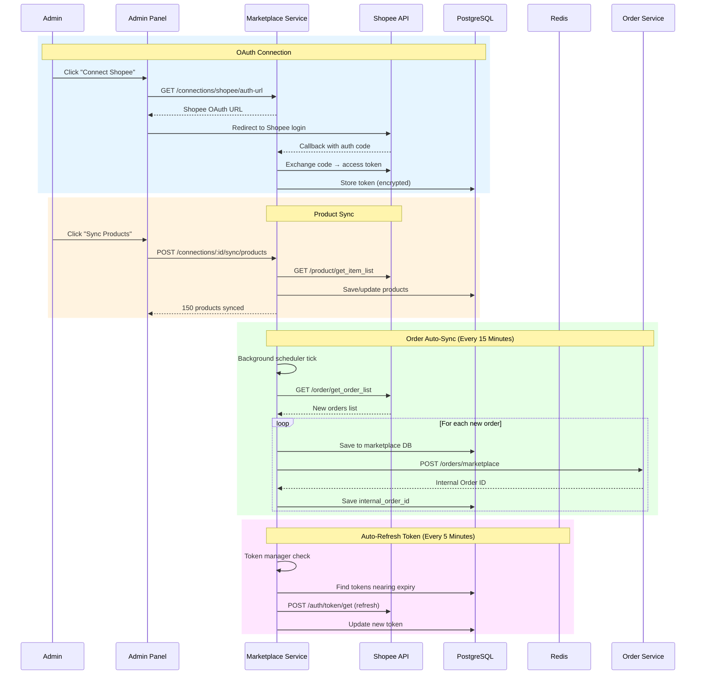
```mermaid
sequenceDiagram
    participant A as Admin
    participant FE as Admin Panel
    participant MKT as Marketplace Service
    participant SH as Shopee API
    participant DB as PostgreSQL
    participant RD as Redis
    participant ORD as Order Service

    rect rgb(230, 245, 255)
    Note over A,DB: OAuth Connection
    A->>FE: Click "Connect Shopee"
    FE->>MKT: GET /connections/shopee/auth-url
    MKT-->>FE: Shopee OAuth URL
    FE->>SH: Redirect to Shopee login
    SH-->>MKT: Callback with auth code
    MKT->>SH: Exchange code → access token
    MKT->>DB: Store token (encrypted)
    end

    rect rgb(255, 243, 224)
    Note over MKT,SH: Product Sync
    A->>FE: Click "Sync Products"
    FE->>MKT: POST /connections/:id/sync/products
    MKT->>SH: GET /product/get_item_list
    MKT->>DB: Save/update products
    MKT-->>FE: 150 products synced
    end

    rect rgb(230, 255, 230)
    Note over MKT,ORD: Order Auto-Sync (Every 15 Minutes)
    MKT->>MKT: Background scheduler tick
    MKT->>SH: GET /order/get_order_list
    SH-->>MKT: New orders list
    loop For each new order
        MKT->>DB: Save to marketplace DB
        MKT->>ORD: POST /orders/marketplace
        ORD-->>MKT: Internal Order ID
        MKT->>DB: Save internal_order_id
    end
    end

    rect rgb(255, 230, 255)
    Note over MKT,RD: Auto-Refresh Token (Every 5 Minutes)
    MKT->>MKT: Token manager check
    MKT->>DB: Find tokens nearing expiry
    MKT->>SH: POST /auth/token/get (refresh)
    MKT->>DB: Update new token
    end
```

---

### 7. Customer & CRM (Customer Management)

Customer data management from multiple channels — storefront, agents, and manual admin entry.

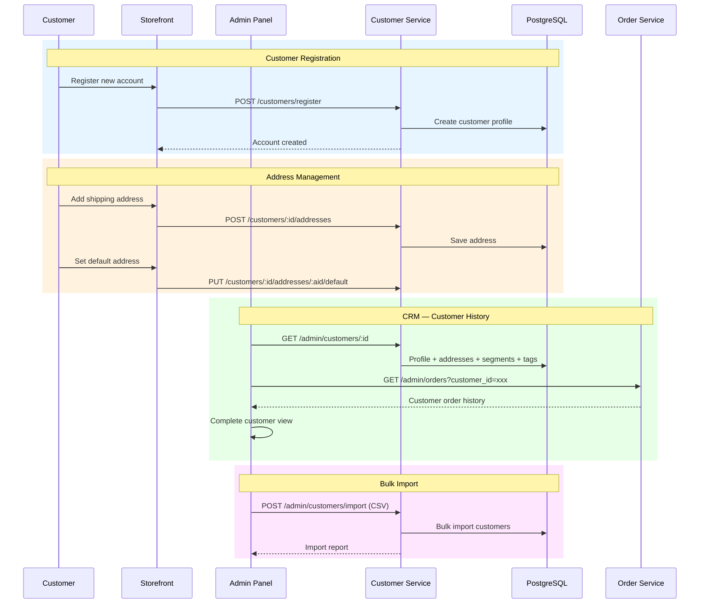
```mermaid
sequenceDiagram
    participant P as Customer
    participant ST as Storefront
    participant AD as Admin Panel
    participant CUST as Customer Service
    participant DB as PostgreSQL
    participant ORD as Order Service

    rect rgb(230, 245, 255)
    Note over P,DB: Customer Registration
    P->>ST: Register new account
    ST->>CUST: POST /customers/register
    CUST->>DB: Create customer profile
    CUST-->>ST: Account created
    end

    rect rgb(255, 243, 224)
    Note over P,DB: Address Management
    P->>ST: Add shipping address
    ST->>CUST: POST /customers/:id/addresses
    CUST->>DB: Save address
    P->>ST: Set default address
    ST->>CUST: PUT /customers/:id/addresses/:aid/default
    end

    rect rgb(230, 255, 230)
    Note over AD,ORD: CRM — Customer History
    AD->>CUST: GET /admin/customers/:id
    CUST->>DB: Profile + addresses + segments + tags
    AD->>ORD: GET /admin/orders?customer_id=xxx
    ORD-->>AD: Customer order history
    AD->>AD: Complete customer view
    end

    rect rgb(255, 230, 255)
    Note over AD,DB: Bulk Import
    AD->>CUST: POST /admin/customers/import (CSV)
    CUST->>DB: Bulk import customers
    CUST-->>AD: Import report
    end
```

---

### 8. Sales Agent System

Sales agents register through admin and can place orders on behalf of customers. Commissions are calculated automatically.

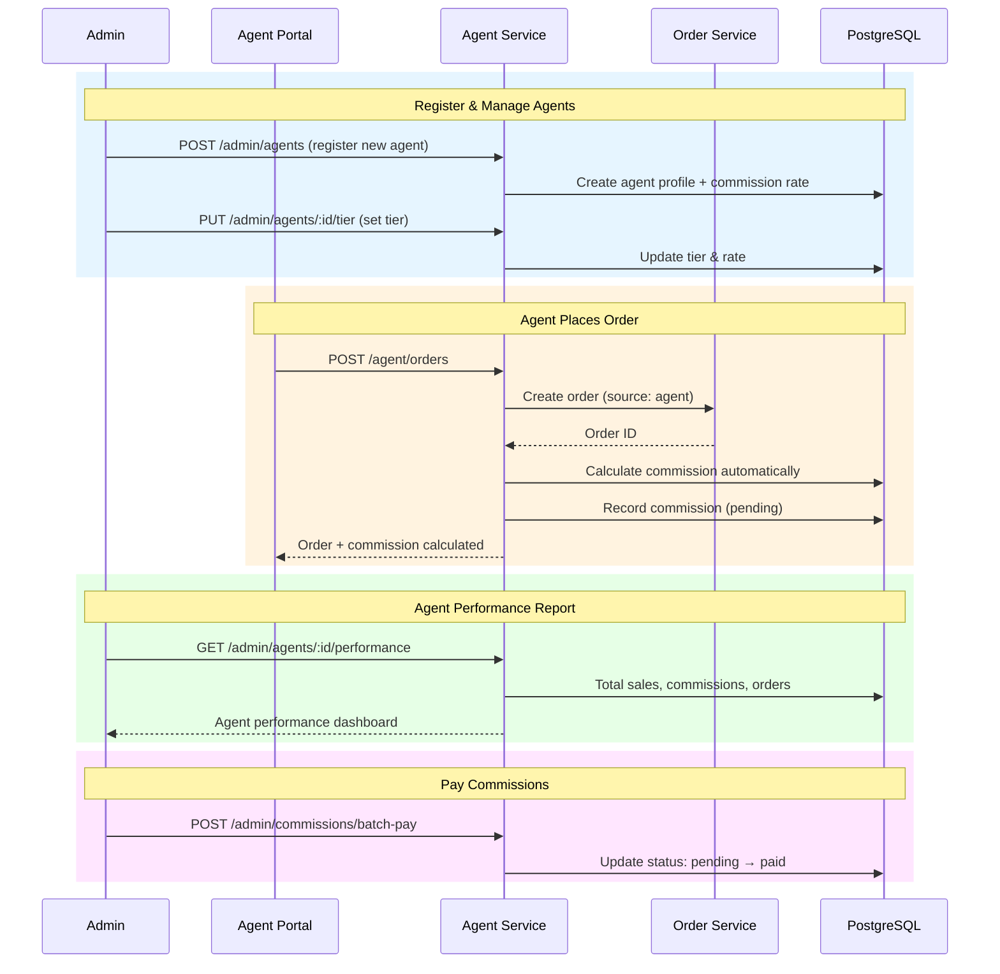
```mermaid
sequenceDiagram
    participant AD as Admin
    participant AGP as Agent Portal
    participant AGT as Agent Service
    participant ORD as Order Service
    participant DB as PostgreSQL

    rect rgb(230, 245, 255)
    Note over AD,DB: Register & Manage Agents
    AD->>AGT: POST /admin/agents (register new agent)
    AGT->>DB: Create agent profile + commission rate
    AD->>AGT: PUT /admin/agents/:id/tier (set tier)
    AGT->>DB: Update tier & rate
    end

    rect rgb(255, 243, 224)
    Note over AGP,DB: Agent Places Order
    AGP->>AGT: POST /agent/orders
    AGT->>ORD: Create order (source: agent)
    ORD-->>AGT: Order ID
    AGT->>DB: Calculate commission automatically
    AGT->>DB: Record commission (pending)
    AGT-->>AGP: Order + commission calculated
    end

    rect rgb(230, 255, 230)
    Note over AD,DB: Agent Performance Report
    AD->>AGT: GET /admin/agents/:id/performance
    AGT->>DB: Total sales, commissions, orders
    AGT-->>AD: Agent performance dashboard
    end

    rect rgb(255, 230, 255)
    Note over AD,DB: Pay Commissions
    AD->>AGT: POST /admin/commissions/batch-pay
    AGT->>DB: Update status: pending → paid
    end
```

---

### 9. Support Tickets

Ticket system for managing customer inquiries and complaints.

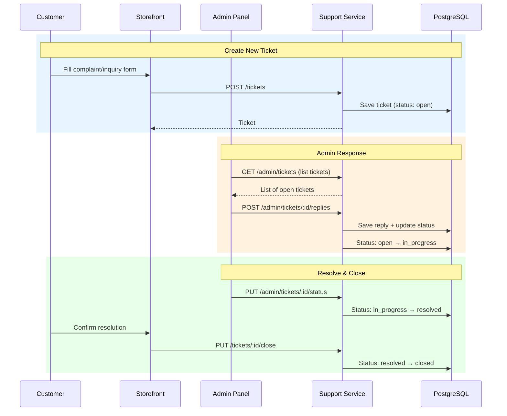
```mermaid
sequenceDiagram
    participant P as Customer
    participant ST as Storefront
    participant AD as Admin Panel
    participant SUP as Support Service
    participant DB as PostgreSQL

    rect rgb(230, 245, 255)
    Note over P,DB: Create New Ticket
    P->>ST: Fill complaint/inquiry form
    ST->>SUP: POST /tickets
    SUP->>DB: Save ticket (status: open)
    SUP-->>ST: Ticket #TIK-001
    end

    rect rgb(255, 243, 224)
    Note over AD,DB: Admin Response
    AD->>SUP: GET /admin/tickets (list tickets)
    SUP-->>AD: List of open tickets
    AD->>SUP: POST /admin/tickets/:id/replies
    SUP->>DB: Save reply + update status
    SUP->>DB: Status: open → in_progress
    end

    rect rgb(230, 255, 230)
    Note over AD,DB: Resolve & Close
    AD->>SUP: PUT /admin/tickets/:id/status
    SUP->>DB: Status: in_progress → resolved
    P->>ST: Confirm resolution
    ST->>SUP: PUT /tickets/:id/close
    SUP->>DB: Status: resolved → closed
    end
```

---

### 10. Reports & Analytics

Real-time analytics dashboard for monitoring business performance.

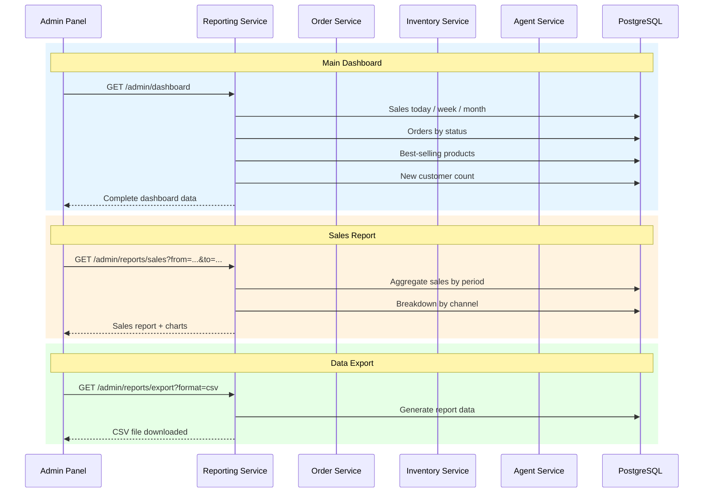
```mermaid
sequenceDiagram
    participant AD as Admin Panel
    participant RPT as Reporting Service
    participant ORD as Order Service
    participant INV as Inventory Service
    participant AGT as Agent Service
    participant DB as PostgreSQL

    rect rgb(230, 245, 255)
    Note over AD,DB: Main Dashboard
    AD->>RPT: GET /admin/dashboard
    RPT->>DB: Sales today / week / month
    RPT->>DB: Orders by status
    RPT->>DB: Best-selling products
    RPT->>DB: New customer count
    RPT-->>AD: Complete dashboard data
    end

    rect rgb(255, 243, 224)
    Note over AD,DB: Sales Report
    AD->>RPT: GET /admin/reports/sales?from=...&to=...
    RPT->>DB: Aggregate sales by period
    RPT->>DB: Breakdown by channel
    RPT-->>AD: Sales report + charts
    end

    rect rgb(230, 255, 230)
    Note over AD,DB: Data Export
    AD->>RPT: GET /admin/reports/export?format=csv
    RPT->>DB: Generate report data
    RPT-->>AD: CSV file downloaded
    end
```

---

### 11. Inter-Service Communication

Complete communication map between all microservices via NATS Event Bus and direct HTTP calls.

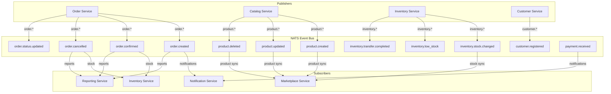
```mermaid
graph TB
    subgraph NATS_Events["NATS Event Bus"]
        direction TB
        E1["order.created"]
        E2["order.confirmed"]
        E3["order.cancelled"]
        E4["order.status.updated"]
        E5["product.created"]
        E6["product.updated"]
        E7["product.deleted"]
        E8["inventory.stock.changed"]
        E9["inventory.low_stock"]
        E10["inventory.transfer.completed"]
        E11["customer.registered"]
        E12["payment.received"]
    end

    subgraph Publishers["Publishers"]
        ORD_P["Order Service"]
        CAT_P["Catalog Service"]
        INV_P["Inventory Service"]
        CUST_P["Customer Service"]
    end

    subgraph Subscribers["Subscribers"]
        INV_S["Inventory Service"]
        MKT_S["Marketplace Service"]
        NOTIF_S["Notification Service"]
        RPT_S["Reporting Service"]
    end

    ORD_P -->|order.*| E1 & E2 & E3 & E4
    CAT_P -->|product.*| E5 & E6 & E7
    INV_P -->|inventory.*| E8 & E9 & E10
    CUST_P -->|customer.*| E11

    E2 & E3 -->|stock| INV_S
    E5 & E6 & E7 -->|product sync| MKT_S
    E8 -->|stock sync| MKT_S
    E1 & E12 -->|notifications| NOTIF_S
    E1 & E2 & E3 -->|reports| RPT_S
```

#### Inter-Service HTTP Calls

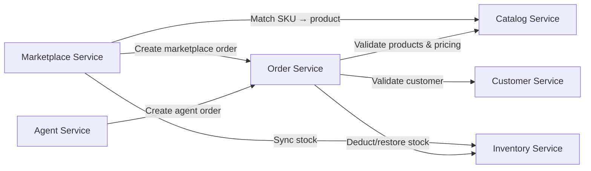
```mermaid
graph LR
    ORD["Order Service"]
    CAT["Catalog Service"]
    INV["Inventory Service"]
    AGT["Agent Service"]
    MKT["Marketplace Service"]
    CUST["Customer Service"]

    ORD -->|"Validate products & pricing"| CAT
    ORD -->|"Deduct/restore stock"| INV
    ORD -->|"Validate customer"| CUST
    AGT -->|"Create agent order"| ORD
    MKT -->|"Create marketplace order"| ORD
    MKT -->|"Match SKU → product"| CAT
    MKT -->|"Sync stock"| INV
```

---

### 12. User Flow — Online Store (Storefront User Journey)

Complete user journey from browsing the store to order completion.

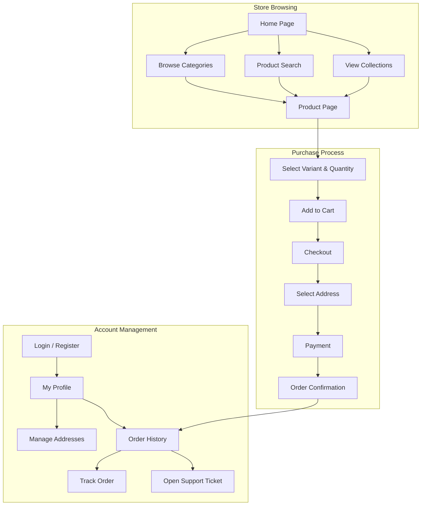
```mermaid
graph TB
    subgraph Browsing["Store Browsing"]
        HOME["Home Page"] --> BROWSE["Browse Categories"]
        HOME --> SEARCH["Product Search"]
        HOME --> COLL["View Collections"]
        BROWSE --> PDP["Product Page"]
        SEARCH --> PDP
        COLL --> PDP
    end

    subgraph Purchase["Purchase Process"]
        PDP --> VARIANT["Select Variant & Quantity"]
        VARIANT --> CART["Add to Cart"]
        CART --> CHECKOUT["Checkout"]
        CHECKOUT --> ADDRESS["Select Address"]
        ADDRESS --> PAY["Payment"]
        PAY --> CONFIRM["Order Confirmation"]
    end

    subgraph Account["Account Management"]
        LOGIN["Login / Register"]
        PROFILE["My Profile"]
        ADDR_MGMT["Manage Addresses"]
        ORDER_HIST["Order History"]
        TRACK["Track Order"]
        TICKET["Open Support Ticket"]

        LOGIN --> PROFILE
        PROFILE --> ADDR_MGMT
        PROFILE --> ORDER_HIST
        ORDER_HIST --> TRACK
        ORDER_HIST --> TICKET
    end

    CONFIRM --> ORDER_HIST
```

---

### 13. User Flow — Admin Panel (Admin Dashboard Journey)

Overview of all modules in the admin panel that manage every aspect of the business.


```mermaid
graph TB
    subgraph Dashboard["Main Dashboard"]
        DASH["Sales & Orders Summary"]
    end

    subgraph Products["Product Management"]
        PROD_LIST["Product List"]
        PROD_ADD["Add Product"]
        PROD_EDIT["Edit Product & Variants"]
        CAT_MGMT["Categories & Collections"]
        PROD_LIST --> PROD_ADD
        PROD_LIST --> PROD_EDIT
        PROD_LIST --> CAT_MGMT
    end

    subgraph Orders["Order Management"]
        ORD_LIST["Order List"]
        ORD_DETAIL["Order Details"]
        ORD_STATUS["Update Status"]
        ORD_MANUAL["Create Manual Order"]
        ORD_LIST --> ORD_DETAIL
        ORD_DETAIL --> ORD_STATUS
        ORD_LIST --> ORD_MANUAL
    end

    subgraph Inventory["Inventory & Warehouse"]
        STOCK["Stock Levels"]
        WAREHOUSE["Manage Warehouses"]
        TRANSFER["Stock Transfers"]
        ALERTS["Low Stock Alerts"]
        STOCK --> TRANSFER
        STOCK --> ALERTS
        STOCK --> WAREHOUSE
    end

    subgraph Customers["Customers & CRM"]
        CUST_LIST["Customer List"]
        CUST_DETAIL["Customer Profile"]
        CUST_SEG["Segments & Tags"]
        CUST_IMPORT["CSV Import"]
        CUST_LIST --> CUST_DETAIL
        CUST_LIST --> CUST_SEG
        CUST_LIST --> CUST_IMPORT
    end

    subgraph Marketplace["Marketplace Integration"]
        MKT_CONN["Shopee/TikTok Connections"]
        MKT_PROD["Product Sync"]
        MKT_ORD["Order Sync"]
        MKT_ANALYTICS["Marketplace Analytics"]
        MKT_CONN --> MKT_PROD
        MKT_CONN --> MKT_ORD
        MKT_CONN --> MKT_ANALYTICS
    end

    subgraph Agents["Agent Management"]
        AGT_LIST["Agent List"]
        AGT_COMM["Commissions & Payments"]
        AGT_PERF["Agent Performance"]
        AGT_LIST --> AGT_COMM
        AGT_LIST --> AGT_PERF
    end

    subgraph Reports["Reports & Analytics"]
        RPT_SALES["Daily/Monthly Sales"]
        RPT_PRODUCT["Product Performance"]
        RPT_EXPORT["CSV Export"]
        RPT_SALES --> RPT_EXPORT
        RPT_PRODUCT --> RPT_EXPORT
    end

    subgraph Support["Customer Support"]
        TIK_LIST["Ticket List"]
        TIK_REPLY["Reply to Tickets"]
        TIK_LIST --> TIK_REPLY
    end

    DASH --> Products
    DASH --> Orders
    DASH --> Inventory
    DASH --> Customers
    DASH --> Marketplace
    DASH --> Agents
    DASH --> Reports
    DASH --> Support
```

---

## Deployment

All services run in Docker containers on a single VPS with Docker Compose configuration.

```
  Production Infrastructure
  ════════════════════════════════════════
  Server         : 1x VPS (Linux)
  Containers     : 21 Docker containers
  Orchestration  : Docker Compose
  Reverse Proxy  : Nginx + SSL (Let's Encrypt)
  Database       : PostgreSQL 16 (9 schemas)
  Cache          : Redis 7
  Search         : Meilisearch
  Event Bus      : NATS JetStream
  Object Storage : MinIO
  Tracing        : Jaeger + OpenTelemetry
```

| Operational Feature | Description |
|---------------------|-------------|
| Health Checks | Every service exposes `/health` — Docker checks periodically |
| Structured Logging | JSON logging (Zap) — easy to search and debug |
| Distributed Tracing | OpenTelemetry → Jaeger — trace requests across services |
| Graceful Shutdown | Signal handling (SIGTERM) — completes requests before shutting down |
| Auto-Restart | `restart: unless-stopped` — recovers automatically after failure |
| Background Jobs | Token refresh (5 min), order sync (15 min), analytics cache |

---

<div align="center">

**Designed & built entirely by Muhammad Luqman**

Solo Full-Stack Developer & System Architect

*Go, Next.js, PostgreSQL, Docker, and the spirit of Malaysian batik*

Terengganu, Malaysia

</div>